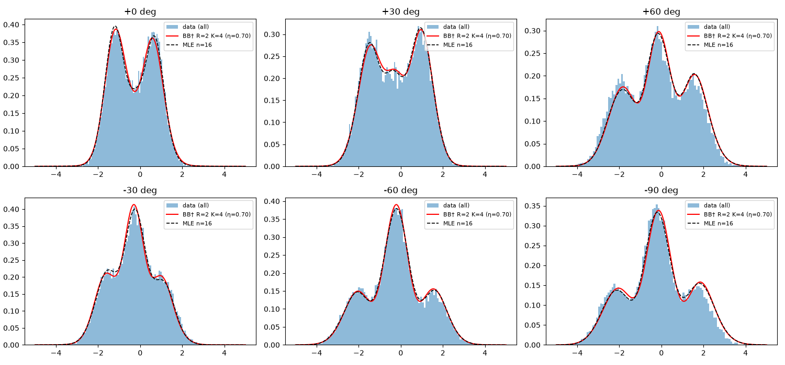
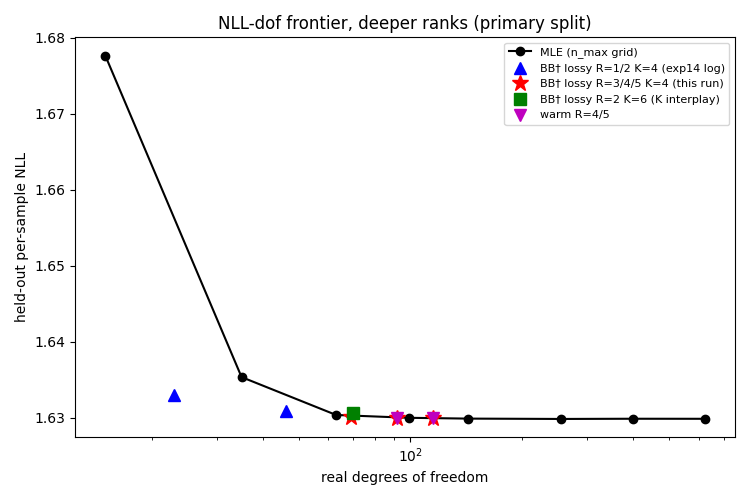

# wigner-splat

**Gaussian Splatting for Quantum State Tomography** — 符号付き異方性ガウス混合を
3DGS 流の微分可能最適化で homodyne 測定データにフィットし、Wigner 関数を再構成する。

## 主張(2026-07-06 サーベイ通過後の定式化)

3DGS-for-Radon-tomography 機構([R2-Gaussian 2024](https://arxiv.org/abs/2405.20693)、
[X²-Gaussian 2025](https://arxiv.org/abs/2503.21779))と、符号付きガウス混合による
Wigner 負性表現([Kenfack et al. 2004](https://arxiv.org/abs/physics/0304029)、
[Tosca et al. 2025](https://arxiv.org/abs/2507.14076))という **2つの独立した先行系譜を、
実測 homodyne データからの逆問題として初めて統合する**。

対応関係:

| 3DGS | 本リポジトリ |
|---|---|
| カメラ姿勢 | homodyne 測定の局発位相 θ(位相空間の回転角) |
| レンダリング(投影) | Radon 変換(Wigner 関数の周辺分布 = 測定される quadrature 分布) |
| スプラット | 位相空間上の異方性ガウス成分 |
| 非負の不透明度 | **符号付き重み**(負スプラット = Wigner 負性 = 非古典性) |
| densification / pruning | 勾配ノルム駆動の成分分裂・剪定(TODO) |

固有の技術的困難(=貢献の中身): 負の重みを許しながら、物理的制約
(全確率 1、周辺分布の非負性、密度演算子の正定値性)を保つ最適化。

## 反証条件

同一ショット数で iterative MLE に fidelity・速度の両方で勝てないなら、
このアプローチは計算上の利得を生まないと結論し、その旨を記録する。

**判定(2026-07-06、実験03: 単一モード猫状態 α=1.5、12角、n_max=20 の R ρ R)**:
fidelity は全ショット予算で splat が勝つ(250 shots/angle で 0.980 vs 0.969、
4000 で 0.991 vs 0.987 — ショット効率の優位は実在)が、速度は MLE が約2倍速く
(~0.6s vs ~1.3s)、条件は**不成立**。約束通り記録する: **単一モード・この規模では
計算上の利得は生まれない。** 残る仮説はスケーリングである — 多モードでは Fock 基底
MLE の次元が指数爆発する(n_max^モード数)のに対し splat のパラメータ数は O(K) に
留まる。これは多モード拡張(ロードマップ)で検証し、そこでも勝てなければ
アプローチ全体を棄却する。

**判定・2モード(2026-07-07、実験04: もつれ猫 |α,α⟩+|−α,−α⟩ α=1.5、4×4 角度対、
Fock MLE は n_max=12 → 144次元)**: 単一モードから**役割が逆転**した。速度は splat が
全予算・全シードで **6–11倍**勝ち(~4 s vs 27–45 s)— 予言した O(K) vs n_max^モード数
のスケーリング分離が実測された。fidelity は統計的互角(splat 0.921±0.011 vs MLE
0.926±0.007、差 0.003–0.006 はシードノイズ 0.015–0.018 未満)で、両者とも同じ有限
ショット天井に座る(MLE の打ち切り上限は 0.99999)。もつれ負性は両者が回復(Wmin
≈ −0.07 vs 真値 −0.078)。厳密な「両勝ち」は平均では未達だが、**反証条件のトリガー
(両方で負ける)は発動しない**: 同等品質を約1/10の計算で得ること自体が計算上の利得
である。前提条件は**完全 4×4 共分散**であること — 分離可能(モードごとブロック対角)
スプラットは fidelity 0.50 で完全敗北する(**もつれ ⟺ モード間相関を持つ傾いた共分散**、
が本質。実験04の図と `tests/test_two_mode_fit.py` の xfail に記録)。決定打は3モード
(MLE は 12³=1728 次元で非現実的になる)で付ける。

**判定・2モード確定版(実験07: 20シード対検定)**: 対応のある t(19)=+1.62、p=0.121 で
**有意差なし = 互角が統計的に確定**(平均差 +0.0066、95%CI [−0.0019, +0.0150])。
公式表現: 「splat は MLE と統計的に同等の fidelity を約 1/7.4 の計算で達成する」。

**判定・3モード(2026-07-07、実測値。公式戦=実験06)**: **splat の両勝ち(seed 42 公式対戦)。**
3×3×3 角度組 × 2000 shots、bins=24(0.14 カウント/セル)にて — splat(6×6 完全共分散、
28 パラメータ/個): F 0.62–0.76(3シード)、稜線 (p₁+p₂+p₃)/√3 をデータから検出、負性回復、
**~15 s**。MLE(n_max=8 → **512 次元**、打ち切り上限 0.993、公式ログ seed 42): 1.76 s/反復、
**900 s 予算で 511 反復・F 0.676・未収束(DNF)**。対数尤度は 100 反復以内で頭打ちになる一方、
fidelity は減速しながら(公式ログで ~5×10⁻⁴ → ~1×10⁻⁴/反復)ゆっくり登るのみで、予算内に
splat 品質(0.756)へ届かない — 測定制約 1.8万行 vs 密度行列 26万パラメータの劣決定性を
強く示唆する挙動(尤度の平坦方向をゆっくり進む)。減速する漸近的な登りのため、上限 0.993 への
到達時間はクリーンには外挿できない(素朴には数時間規模)。スケーリング系列の確定値:
1モード 20次元/0.5–0.9 s(MLE 2倍速で勝ち)→ 2モード 144次元/~32 s(互角、splat 7.4倍速)
→ 3モード 512次元/**900 s DNF**(seed 42 で splat が fidelity 0.756 vs 0.676・速度 58x の
両方で勝ち)。

**未検証の作業仮説(実験06 の1点測定からの外挿、まだ確立された結論ではない)**:
「モード数 ≥ 3 では splat が実用上唯一のフル・トモグラフィー手段」。反証条件(両方で負ける)は
発動しないが、この一般化には次が要る — (a) **MLE も複数シードで評価**(現状 MLE は seed 42
のみ。splat seed 2 の 0.624 は MLE seed 42 の 0.676 を下回る)、(b) **bin 平均補正の非対称の
解消**(現状 splat のみモデルに bin 平均を畳み込み、MLE は bin 中心近似)、(c) 加速MLE・低ランク
/純状態制約など**他ベースラインとの比較**、(d) **signed splat の PSD 物理性保証**(未達のため
現状の "fidelity" は厳密には Wigner overlap score。issue #8)。

## 実データ戦: 公開 homodyne データの GKP 状態(実験12–14・18、2026-07-14〜16)

合成ベンチマークで育てた構成的物理 ρ=BB† トラック(経緯は下のロードマップ issue
#8/#25/#27/#28・実験11 の項)を、初めて実測データに投入した 4 round の記録。データは公開データ
サーベイ(`docs/2026-07-14-public-data-survey--recorded.md`)が生 homodyne 公開データとして
唯一確認できた、Konno et al., Science 383, 289 (2024) の伝搬光 GKP 状態
(Dryad [doi:10.5061/dryad.t76hdr86j](https://doi.org/10.5061/dryad.t76hdr86j)、CC0)—
LO 位相 6 点(0/±30/±60/−90°)× 各約 2 万ショットの生 quadrature 値。元 README・帰属とともに
`experiments/12_gkp_data/data/` に再配布している。単位規約はデータ自身で検証: 0° のピーク間隔
~1.69 ≈ √π が本リポジトリの真空分散 1/2 規約とそのまま一致(リスケール不要)。位相に依存しない
平均オフセット ~−0.26 は装置起因(コヒーレント変位なら位相とともに回転するはず)— 差し引かず、
そのままフィットした。評価はすべて split 内の held-out per-sample NLL(小さいほど良い)。

**第1戦・明確な負け(実験12、issue #41、2026-07-14)**: 教科書的フルランク MLE(R ρ R、
n_max=25、論文自身の手法クラス)が held-out NLL **1.6299**(秒未満)。純粋 squeezed-product
ansatz(bbdagS K=4/6、解析勾配、~30–40 s)は **1.7670 / 1.7819** で完敗。overlay 図が敗因の
署名を示す — 干渉ディップが深すぎ、ピークが高すぎる。純粋状態はフリンジのコントラストを洗い
流せず、実際の(損失を受けた)GKP 状態は混合状態である。約束どおり記録した初の実データ判定:
不足は ket の形ではなく **rank(混合性)と検出効率** = 既に filed 済みの issue #40/#42 が狙う
ギャップそのもの。scale の注意: 1 モードでは MLE 行列は 25×25 と小さく秒未満 — スケーリング論は
無傷で、実データが試すのはフォワードモデルの物理。(訂正記録: 初出の「K=6 は誤った多様体内の
過適合」は誤り。K=6 は train NLL でも K=4 より悪く(1.75386 vs 1.74336、best-of-3)、これは
最適化不良であって、過適合の主張はどちら向きにも支持されない — PR #37 の owner review 起点)

**第2戦・損失モデルがギャップの 98% を閉じる(実験13、issue #42 部分、2026-07-14)**: bbdagS に
検出効率フォワードモデルを実装 — 測定 pdf = 純粋 ansatz pdf ⊛ ガウス(分散 (1−η)/2 + electronic
noise)。これは loss チャネル通過後状態の homodyne marginal と**厳密に**一致し、PSD 構成のまま
全体が閉形式(pair-overlap ガウスの tilt + ∂log f 多項式トリックで解析勾配)。η は joint fit。
Fock 基底 loss チャネル(独立ルート)との厳密一致を含む 12 テストで固定。same-K same-budget の
η ablation: K=4 pure 1.75542 → lossy **1.63304** = 経験的 MLE frontier best(1.62984)への
ギャップの **97.5%** を物理パラメータ 1 個が閉じる(K=6 で 98.2%、代替 reshuffle で 97.8%。
fitted η は K・シード・split を通じ 0.638–0.643 で安定)。ただし判定は **descriptive loss**
(記述的な負け): test-selected な MLE frontier best に対する conditional paired-bootstrap
95% CI は [+0.0022, +0.0041](primary)/ [+0.0016, +0.0034](alternate)で両方ゼロの上。
パラメータ効率は観測 Pareto 比較として: 同程度 dof で lossy K=4(23 dof)の 1.63304 vs
MLE n_max=6(35 dof)の 1.63534(MLE frontier は n_max≈8 = 63 dof 以上で平坦 — 当初の「1/17」
枠組みは誤りとして棄却)。残差 +0.002〜+0.004 nats の物理原因(最適化 / 有限 K・純粋状態容量 /
単一ガウス損失チャネルの misspecification)は未特定のまま #40 へ。(protocol 注記: この round は
PR #37 の owner review が初版 protocol を棄却 → 再宣言後に再走した **exploratory reanalysis**。
再宣言はデータと初回結果を見た後なので preregistered confirmation ではない)

**第3戦・rank 仮説、matched-dof control 付き(実験14、issue #40、2026-07-14)**: rank-R 拡張
`MixedSqueezedKetState`(ρ=BB† を R 本の squeezed-ket 列に拡張し #42 損失チャネルと合成。
PSD 構成・閉形式・解析勾配、10 テストで固定)。primary config は事前固定の lossy R=2 K=4 vs
同一スケジュール rank-1。R2K4 は両 reshuffle で予測能力を descriptive に改善:
CI(R=2 − rank-1) = [−0.00296, −0.00143] / [−0.00283, −0.00124]。frontier gap は縮んで残る:
CI(R=2 − best MLE) = [+0.00055, +0.00149](primary、point +0.00100 — exp13 の +0.00320 から
約 2/3 減)/ [+0.00002, +0.00093](alternate、point +0.00048、CI 分解能で borderline)=
**3 度目の descriptive 負け、ただし半ミリナットまで**。PR #44 の owner review が指摘した通り、
素朴な R=1→2 比較は ket 数(4→8)・dof(23→46)・計算量が rank と同時に動く交絡があり、
**matched-dof control**(R1K8 = 47 dof vs R2K4 = 46 dof、同一スケジュール)で判定: nested な
最適化不良チェック通過(R1K8 の train 1.62882/1.62952 が R1K4 floor 1.62938/1.63019 を下回る)
の上で、held-out は両 reshuffle とも rank 側の勝ち(1.63084 vs 1.63216 / 1.62770 vs 1.62936、
CI [−0.00194, −0.00067] / [−0.00230, −0.00100])→ **「ket・パラメータ容量だけで説明がつく」は
descriptively 不利に**(それでも「physical rank を同定した」はまだ強すぎる、が pre-declared の
読み)。観測 Pareto 帯も広がる: R=2(46 dof)1.63084・R=3(69 dof)1.63009 は各 dof 帯で観測
MLE 曲線の下(alternate では R=2 が ~99 dof まで下)。ただし train の単調改善(1.62938→
1.62761→1.62688)が支持するのは「このスケジュールで train 目的関数が頭打ちしていない」まで
であり「rank 未飽和」ではない — その判定は実験18 へ。事前宣言どおり η-rank の同定不能ドリフト
も観測: fitted η は R=1/2/3 で 0.643→0.701→0.875 — rank が混合性を吸収して損失ノブの分担が
減る。**fitted η はモデルパラメータであり、較正された検出効率ではない**。

**第4戦・frontier とのタイ(実験18、issue #40、2026-07-16)**: 事前宣言の飽和 protocol —
cold R=4(両 reshuffle)と R=5(primary)、warm-start chain R3→4→5、matched ~70 dof の
K-interplay 対(R3K4 = 69 dof vs R2K6 = 70 dof)、split ごとの MLE frontier 再走。R=3 の
再フィットが exp14 のコミット済み数値を厳密再現(cross-run 再現性を固定)。結果、事前宣言の
decision check 順に:

1. **飽和**: best-by-train の Δ(4) = +0.00016 は宣言済み平坦閾値 0.0002 未満、Δ(5) = +0.00000。
   held-out も R3/R4/R5 = 1.63009/1.62993/1.62995(primary)で追随 — rank 曲線はこのスケジュール
   で **R=4–5 で飽和**。
2. **frontier**: CI(R=4 − test-selected best MLE) = **[−0.00002, +0.00020]**(primary、point
   +0.00009)/ **[−0.00017, +0.00003]**(alternate、point −0.00007)。両方ゼロを跨ぐ = 事前宣言の
   分岐に従い **CI 分解能でタイ**。3 連敗(実験12/13/14)の後、初めて descriptive loss のつかな
   かった round。物理モデル側は **92 実パラメータ**、相手の frontier best は **255**、しかも相手は
   test-selected の oracle。
3. **最適化**: warm R=4 の cold best に対する train 改善は +0.00003(宣言閾値 0.0001 未満)→
   cold スケジュールは R=4 で十分 = **under-optimization は残差原因として descriptively 排除**
   (warm chain 終端の warm R=5、train 1.62663 / test 1.62990 も同じ plateau と整合)。
4. **K interplay**: matched ~70 dof でも rank 側が held-out 勝ち(CI(R3K4 − R2K6) =
   [−0.00098, −0.00018])。exp14 の 46 dof control と合わせ、調べた 2 つの frontier 点の両方で
   「dof は ket 数より rank に割くほうが得」。
5. **η ドリフト**(事前宣言): fitted η は R=3/4/5 で 0.87→0.94→0.92、warm R=5 chain では
   0.9948 — rank が伸びるほど損失ノブは絞り出され、純 rank mixture へ収束していく。η がモデル
   パラメータであるという exp14 の stance のまま。

(番号注記: 並行する応用線の実験15 が先にマージされ量子線の番号が繰り上がったため、実験18 は
`experiments/18_gkp_saturation` に居るがコミット済み raw log のヘッダは旧番号 exp17 のまま。
research-log の各エントリ冒頭に同種の注記あり)

<p align="center">
  
</p>

<p align="center">
  
</p>

**スコープ注記(全 round 共通 — 過剰主張の禁止)**: この 4 round はすべて **exploratory**
分析である。(a) primary/alternate の 2 split は**同一観測の reshuffle** であり、独立 holdout は
存在しない。(b) MLE 側の対戦相手は **test-selected**(テストデータで最良の n_max を選んだ
oracle = MLE に有利な設定)。(c) bootstrap CI はフィット済みモデルと test-selected n_max に
**conditional** で、モデル選択の不確実性を勘定しない。(d) 「タイ」は CI statement であって
**preregistered confirmation ではない**。事前登録つきの確認は、新しいデータセットか held-out
セッションが得られた場合にのみ行う(#41 スコープ)。また η の joint fit がこのデータで安全
だったのは規模(単一モード ~6 万サンプル、η が 0.638–0.643 で安定)の産物であり、小データでは
同定不能 — 実験17(issue #42 全スコープ、ロードマップの該当項参照)の対照で、27k サンプルの
3 モード猫では尤度が (状態, η) 方向に ~1e-5 nats で平坦なまま fidelity が 0.06〜0.80 に散る
ことを確認済み。訓練目的関数が fidelity の差に盲目になりうる同種の budget-blindness は、
実験16(issue #39、多シード再現)が init 軸でも記録している。

4 round の要約: 損失モデル化がギャップの ~98% を閉じ(実験13)、rank-2 が残りの 2/3 を削り
(実験14)、rank-4 が残りを統計的タイに変えた(実験18)。各段は matched-dof control により
「容量でなく rank」に帰属され、warm start が終端の under-optimization を排除した。数値・図・
全 protocol は `experiments/12_gkp_data` / `13_gkp_eta` / `14_gkp_rank` / `18_gkp_saturation` の
コミット済み log と、research-log の日付エントリ
([exp12](docs/research-log.md#2026-07-14--first-real-data-furusawa-group-gkp-states-experiment-12-issue-41)、
[exp13](docs/research-log.md#2026-07-14--gkp-rematch-exploratory-loss-model-reanalysis-experiment-13-issue-42-partial)、
[exp14](docs/research-log.md#2026-07-14--rank-freedom-on-real-data-exploratory-rank-hypothesis-test-experiment-14-issue-40)、
[exp18](docs/research-log.md#2026-07-16--rank-saturation-on-the-gkp-data-the-frontier-gap-closes-experiment-18-issue-40))にある。

## 構成

```
wigner_splat/
  states.py    # 参照状態(猫状態): Wigner 関数・homodyne 分布・サンプラー
  forward.py   # 符号付きガウス混合の Radon 投影(閉形式)= 微分可能フォワードモデル
  fit.py       # 再構成器: ヒストグラム損失 + 負性ペナルティ + Adam(解析勾配)
               #   + densification(勾配ノルム分裂・剪定・重み勾配場による符号付き誕生)
  fock.py      # 打ち切り Fock 基底: 猫状態の密度行列・Wigner 変換・fidelity
  mle.py       # iterative MLE ベースライン(Lvovsky R ρ R)
experiments/
  01_cat_state/       # 最初の実験: 猫状態のシミュレーション再構成(固定 K=8)
  02_densification/   # K=4 から適応成長させる再構成(固定 K=8 を上回る)
  03_mle_baseline/    # splat vs MLE 対照実験(反証条件の判定)
tests/           # フォワードモデルと物理の整合性テスト
docs/
  prior-art-survey.md  # 先行研究サーベイ(2026-07-06)
```

## クイックスタート

```bash
pip install numpy matplotlib pytest
python -m pytest tests/ -q          # 物理整合性テスト
python experiments/01_cat_state/run.py   # データ生成 → 再構成 → 図の出力
```

## ロードマップ

- [x] 猫状態の homodyne シミュレーションデータ生成器(ショットノイズ込み)
- [x] 符号付きガウス混合の閉形式 Radon フォワードモデル
- [x] v0 フィッタ(固定 K、数値勾配+Adam、負性ペナルティ)
- [x] 猫状態(α=1.5)で Wigner 負性の回復を確認(min −0.194 vs 真値 −0.190、相対L2 13%)
- [x] 解析勾配化(閉形式チェインルール。実験 01 が ~29s → ~1.6s、相対L2 12.5%、負性回復を維持)
- [x] densification / pruning(勾配ノルム分裂・剪定 + **重み勾配場による符号付き誕生**。
      K=4→9 で相対L2 7.1%、固定 K=8 の 12.5% を上回る。分裂だけでは全正の局所解から
      負性が生まれない → 仮想スプラットの重み勾配 ∂L/∂w(μ)(=残差の逆投影)の極値に
      降下方向の符号で新スプラットを誕生させることで解決)
- [x] 検出効率・ガウスノイズのモデル化(issue #42、2026-07-14〜16 完了): 測定 pdf = 純粋 pdf ⊛
      ガウス(分散 (1−η)/2 + σ_el²)を**全再構成器**に展開。bbdagS(実験13、η 同時フィット可)、
      bbdagM(ξ=0 委譲で厳密)、purefock3(非効率 homodyne POVM 行列を Gauss–Hermite で厳密構築、
      σ_el も切り捨てなし)、splat(位相空間写像 μ→√ημ, Σ→ηΣ+σ²I₆ と厳密一致 = フィットは損失前
      Wigner の推定)。対照実験17: ノイズ無視は全手法で系統誤差(例 purefock3 F 0.893)、既知 η 補正で
      回復(0.973)。**η 同時推定は小データでは同定不能**(尤度が (状態, η) 方向に ~1e-5 nats で平坦、
      F は 0.06〜0.80 に散る)— 較正値があるなら使うこと(diagnose_eta.py に固定)
- [x] iterative MLE ベースラインとの比較(実験03。fidelity: splat 勝ち(全予算)、
      速度: MLE 勝ち(単一モードでは行列が小さい)→ 反証条件は不成立、上記に記録)
- [ ] 物理制約(正定値性)の厳密な扱い — Kenfack 型の閉形式制約 vs ペナルティ vs 事後射影(issue #8)
      - **観察(実験08)**: 閉形式 Fock 射影(`wigner_splat/fock_project.py`)で splat→ρ を materialize。
        1モード(F=0.991)は min 固有値 −3.4×10⁻²・negativity 7×10⁻²(n_max≥28 で収束、低 n は過小評価)。
        3モード(exp06 seed42、n_max=8)は min 固有値 −1.4×10⁻¹・negativity 2.7×10⁻¹ =
        モード数増で非物理性が悪化(n_max=8 制約下の下界、真値はさらに悪い)。良好なフィットでも
        物理状態でない。cat 由来 ρ では機械精度で PSD を確認(cat1 Fock 一致 4.4e−9、cat3 trace が
        既知打ち切り上限 0.99321 と厳密一致 = 閉形式の独立検証)。
      - **反証条件**: 物理化改修(射影 or 制約)の後、(a) 3モード fidelity が現行 0.756(seed42)から
        ΔF > −0.03 を保ち、かつ (b) 射影後 ρ の min 固有値 ≥ −1e−9(数値誤差内で PSD)を
        **両立できなければ、この物理化アプローチを棄却して記録する**(物理性と再構成品質は両立しない、の意)。
      - **判定(実験08)**: **1モードは解決可能、3モードは tension。**
        - *1モード(full-param PSD polish + 事後射影)*: ペナルティで negativity 0.070→0.007 を
          安く削り(ΔF −0.017)、射影で PSD 化。λ_psd=5〜50 で (a)(b) 両立 → #8 は 1モードで解決可能。
        - *3モード(exp06 seed42、weight-only polish)*: 非物理 negativity を削ると fidelity が
          0.753→~0.4 に崩壊(全 λ で ΔF ≤ −0.32)。反証条件を満たせず **weight-only 物理化は棄却**。
          → **現行の3モード fidelity 優位と PSD 物理性は強い tension にあり、その勝ちは少なくとも
          一部が非物理な Wigner-overlap score に支えられている**。
        - *3モード(shape+weight polish)*: 少数の global shape パラメータ(3ノブ: stripe thin幅・base幅・
          center scale)を重みと同時に polish しても tension は解消せず(ΔF −0.26。weight-only の −0.37 より
          マシだが反証条件 −0.03 の桁違い手前) → **tension は weight-only polish の交絡でなく robust に
          本質的**。full 28-param/splat FD は依然計算非現実的で**未検証**だが、weight-only→3-shape が
          どちらも大きく失敗する趨勢から、signed splat 表現が3モードで物理性と品質を両立する見込みは薄い。
        - 含意: 構成的に物理な **ρ=BB† 型(displaced squeezed ket 重ね合わせ)** への再パラメータ化が
          長期の本筋(penalty/projection 不要で PSD 保証)。
      - **存在結果(実験08、2026-07-11)**: 構成的に物理な ρ=BB† を実装
        (`wigner_splat/bbdag.py` は1モード displaced-squeezed ket、`bbdagM.py` は多モード
        coherent-product ket)。多モード ansatz は3モード cat のターゲット族を含む(target-aligned)。
        過去の実行報告では BB† の exact state fidelity は K=4 で
        0.9501 / 0.9434 / 0.9332(seed 42/1/2)、K=8 seed42 で 0.9507。exp06 の非PSD signed
        splat は同じ target に対する Wigner-overlap score 0.756 / 0.741 / 0.624 だった。
        - training NLL 3.9108(fit) / 3.9153(true state) も過去の報告値。この大小関係だけでは
          global ML optimum や fidelity 上限を特定できない。BB† の raw stdout log・fit parameters は
          保存されておらず、再計算可能な evidence bundle は今後追加する。
        - **scope**: これは「ターゲット族を含む物理 ansatz が、この合成 benchmark で高 fidelity を
          達成できた」という存在結果。signed splat の物理化ではなく、表現も学習損失も異なる
          (BB†: per-sample NLL、splat: histogram L2)。したがって現行 splat 内の負固有成分の必要性は
          判定しない。
        - **フェアベースライン(issue #27、2026-07-13 実測)**: 同じ純粋制約・同じ per-sample NLL・
          同じ Adam +解析勾配で、表現だけ違う対照(`purefock3.py`: 一般 Fock ket 512 複素パラメータ)を
          追加(train 1600 / test 400 の held-out 付き、実験09)。結果(3シード平均): **fidelity は
          generic が上(0.979 vs 0.959)**、計算は BB† が 11倍速(13.8 s vs 156 s)、held-out NLL は
          BB† が真の状態水準(3.919 ≈ true 3.923)で generic は過適合(3.933)。→ フルランク MLE
          (0.676 DNF)に対する fidelity 差の主因は**純粋制約 + サンプル勾配 ML** であり coherent
          ansatz ではない(「ansatz の fidelity 優位」は主張しない)。ansatz が買うのは **11倍速・
          1/32 の実パラメータ数(32 vs 1024)・過適合しない held-out 尤度**。R ρ R の 0.676 は部分的に
          アルゴリズム(ビン化データへの固定点反復)の問題でもあった(同じ 512 次元空間の勾配 ML は
          0.98 に届く)。
        - **out-of-family + rank>1(issue #28、2026-07-13 実測)**: 族外ターゲット 2 種を実装
          (`states3x.py`: 損失チャネル後の猫 = 混合 rank-2、squeezed 猫 = coherent 族外の純粋状態)。
          rank-R 拡張(`MixedCoherentKetState`、ρ=BB† のまま PSD)+ coherent span 上の**厳密 Uhlmann
          fidelity**。結果(実験10): 損失猫(η=0.8)で rank-1 は F≈0.53 で頭打ち(K を増やしても不変
          = ボトルネックは rank。span 内の rank-1 理論上限 0.5336 と整合)、**rank-2 は F=0.9947 で
          回復**。squeezed 猫(r=0.4)は K=2/4/8 で F 0.79→0.81→0.82 と単調改善するが、generic 対照
          (purefock 0.961)に大差 → 次の表現拡張は**多モード squeezed-product ket**。
        - **squeezed-product ansatz + #28 スコープ判定(族の適応力、実験11、2026-07-13 実測)**: 多モード
          displaced-squeezed-product ket(`bbdagS.py`)を実装 — 全パラメータ閉形式解析勾配
          (ペア重なり=複素ガウス積分、∂log f は x の 2 次多項式なので norm 勾配はモーメント比
          R₁=B/2A、R₂=R₁²+1/2A に帰着。ξ=0 特異点は ν=ξ sinh|ξ|/|ξ| で除去。central-diff 一致を
          テストで固定)。squeezed 猫(r=0.4)で **F=0.970 / ~40-55 s**(coherent K=8 の 0.823、
          generic 対照 0.961 を超える。K=2 は初期値鋭敏 — 過剰パラメータ化 K=4 が頑健)。
          **3者比較(実験11)の判定は同一尺度軸(BB† vs MLE の state fidelity)に限定**(splat の
          overlap score は尺度非互換 — 混合ターゲットでは完全値が純度 0.5023、非 PSD では非有界 —
          のため別軸報告): 損失猫 = BB† rank-2 **0.9947**/21 s vs MLE 0.9554/901 s DNF(splat 軸:
          0.4960 = 純度上限の 98.7%)/ squeezed 猫 = BB† **0.970**/54 s vs MLE 0.713/901 s DNF
          (purefock 対照 0.961/183 s、差 +0.009)。**この run では反証条件は不発動**。
          **多シード再現(実験16、issue #39、2026-07-16)**: 3 data × 3 init シードで再現済み。
          squeezed 側の順位は全シード頑健(bbdagS K=4 0.969–0.976 > purefock 0.961–0.969 > MLE
          0.68–0.72)だが対 purefock 差 +0.004〜+0.011 は n=3 で有意化不能(記述的優位に格下げ)。
          lossy 側は **init 脆弱**: rank-2 は 9 init 中 3 で F≈0.52 へ崩落し train NLL では判別
          不能(ΔNLL≈1e-4 vs ΔF≈0.4)、NLL 選択では data seed 1 で 0.9524 と MLE 0.9580 を
          下回り**「負けない」判定が 1/3 シードで反転**。単発ヘッドラインは「best observed」として
          読むこと。**スコープ注意(PR #36 レビューで確定)**: 両ターゲットは
          *旧 rank-1 coherent 族*に対して族外であり、フィットした*拡張族にとっては in-family*。
          実験11が示すのは「故障方向を特定 → 族を拡張 → 同一尺度で勝つ」という**族の適応力**であり、
          拡張族の外への盲目的汎化ではない。その関門は「有限 rank の ket 混合に入らない held-out
          ターゲット」(熱雑音付き損失猫 = フルランク。ノイズモデル化と同一機構)—
          **実験19 で判定(issue #38、2026-07-16)**: 純検出 ket 族は各自の rank 上限にほぼ到達
          (rank-1 は上限 −0.009、敗因は近似能力でなく rank 容量)。**チャネル合成族
          (loss_η∘BB†、フルランク)は blind フィットで F=0.9234 と、収束済みフルランク MLE
          (0.8976、~2.6×10⁵ パラメータ)を ~110 パラメータで上回り、反証条件は不発火**。
          ただし勝った族自体がフルランク族なので「族外汎化の証明」ではなく、記録されるのは
          **blind held-out 性能 1 例**(単一シード・単一ターゲットクラス、普遍主張は不可。
          ターゲットがチャネル合成族の外にあるかは未解決 — 非包含テストを follow-up に記録)。
          **splat の score 1.7674 (>1) は非物理性の直接証明**(純粋ターゲットとの tr(ρσ)≤1 は
          物理状態のみ)— issue #8 の tension がヘッドライン数値に露出した形。
          残: σ_add/シード sweep と非包含テスト(follow-up として記録のみ。held-out フルランク・
          ターゲット判定は実験19、複数シード再現は実験16、rank-R × squeezed 複合 ansatz は
          実験14 で完了)。
        - **解析勾配化(issue #25、2026-07-13 解決)**: NLL 勾配を閉形式化(`bbdagM.nll_and_grad`。
          Z=z†Gz は coherent overlap の Gram、サンプル項は LO 回転の chain rule。central-diff と
          1e-9〜1e-8 級一致をテストで固定)。3モード K=4 が **527 s → 10.6–16.6 s(32–50×、コンテナ間
          変動あり)**、K=8 が 1647 s → 17.6–28.0 s(59–94×)。seed 42 は FD 報告値を 4桁一致で再現
          (K=4 F=0.9501、K=8 F=0.9507、NLL 3.9108)、seeds 1/2 は FD ノイズ消失で改善
          (0.9434→0.9593、0.9332→0.9566)。raw log と **fit パラメータ**をコミット
          (`experiments/08_positivity/out_bbdag_3mode_analytic.log`、
          `evidence/bbdag_analytic_fits.json` — 保存パラメータから F/NLL が再計算できることを
          テストで固定)し、BB† の provenance 欠如を解消(registry primary を committed_raw_log 化)。
          → 「物理保証つき・かつ速い」が単一手法で成立し、splat(15 s)と同スケールに。
- [x] 2モード拡張(実験04・07。分離可能スプラットは F=0.50 で失敗 → 完全 4×4 共分散で
      F=MLE 同等(20シード検定で互角確定)・速度 7.4倍。もつれ ⟺ 傾いた共分散を実証)
- [x] 3モード拡張(実験06。splat F 0.62–0.76 / ~15 s vs MLE(512次元)F 0.676 / 900 s DNF
      — **seed 42 で初の両勝ち**。ビン平均補正の発見(セル中心値との比較はフリンジを系統的に
      減衰させるバイアス)込み。一般化には複数シード/他ベースライン/物理性保証が必要 — 上記判定参照)
- [ ] 表現のもつれコスト予想の理論化(実験05: R は波数 k に比例、もつれ量は飽和 — issue #6)

## 引用すべき近接先行研究

機構: [R2-Gaussian](https://arxiv.org/abs/2405.20693) / [X²-Gaussian](https://arxiv.org/abs/2503.21779) ·
表現: [Kenfack 2004](https://arxiv.org/abs/physics/0304029) / [Tosca 2025](https://arxiv.org/abs/2507.14076) ·
homodyne 最適化: [Strandberg 2022](https://arxiv.org/abs/2202.11584) / [Gaikwad 2025](https://arxiv.org/html/2503.04526v1)

詳細は [docs/prior-art-survey.md](docs/prior-art-survey.md)。
