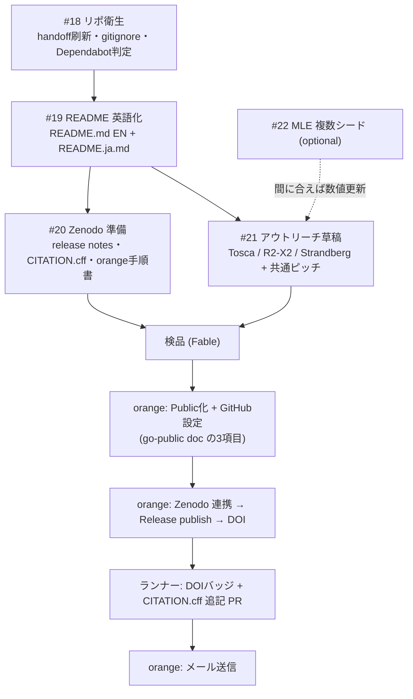

# 2026-07-12 配布キャンペーン計画 — 「学者に面白がってもらう」まで

状態: wip(全 issue クローズ + orange 手動アクション完了で `--done` に改名)
発案・スコープ決定: orange(2026-07-12)。設計: Claude(Fable)。実行: 指揮ランナー(Codex)。

## ゴール / 非ゴール

**ゴール**: 論文は出さない。近接先行研究の学者に「あなたの仕事の上でこういう遊びをしたらこうなった。面白がってください」と届く状態を作る。具体的には:

1. 英語の入口(README 英語化)— 想定読者は日本語を読めない
2. 引用可能な錨(Zenodo DOI)— 誰かがこのアイデアで論文を書いたとき「2026年7月にここにあった」を指せる
3. 著者への直接メール(orange が送信)— found-this-fun の低圧共有

**非ゴール**: 論文投稿、arXiv(endorsement 問題。学者が面白がってくれれば後日自然に開く扉として保留)、ブログ記事(公開後に orange + Claude が /blog で別途)、SNS 展開(共通ピッチ段落の用意まで。投稿は orange の裁量)。

**不変条件**: 反証条件・負けの記録・unverified 但し書きを**等重量で**保存する。このリポの信頼性の源泉であり、アウトリーチの説得力そのもの。over-claim は検品で差し戻す。

## 決定事項(orange 承認済み、2026-07-12)

| 論点 | 決定 |
|---|---|
| README 言語 | README.md を英語簡約版に、現行日本語全文は README.ja.md に保存 |
| 科学ゲート | MLE 複数シード補強([#22](https://github.com/orangewk/wigner-splat/issues/22))は non-blocking。完走を止めない |
| ランナー体制 | Codex 1 本が指揮兼実行。MLE 計算のみ別 worker 可 |
| ブログ | スコープ外・後日 |

## 役割

- **指揮兼実行ランナー(Codex)**: issue #18→#19→#20→#21 を順次完走。#22 は並行 optional。各 issue は PR 経由
- **検品(Claude / Fable)**: 全成果物完了後に一括検品(下記チェックリスト)。指摘は follow-up として指揮ランナーに戻す
- **orange**: PR マージ判断、手動アクション(可視性変更・GitHub 設定・Zenodo publish・メール送信)

## シーケンス

順序の理由: Zenodo の GitHub 連携は public リポが対象なので **Public 化 → Release publish**。メール本文に DOI を入れるので **DOI 取得 → 送信**。

## 作業パッケージ(詳細は各 issue)

| issue | 内容 | 成果物の置き場 |
|---|---|---|
| [#18](https://github.com/orangewk/wigner-splat/issues/18) | handoff.md 刷新・`.codex/` gitignore・Dependabot PR #17 判定 | docs/handoff.md ほか |
| [#19](https://github.com/orangewk/wigner-splat/issues/19) | README 英語化 + リポ description/topics 案 | README.md / README.ja.md |
| [#20](https://github.com/orangewk/wigner-splat/issues/20) | v0.1.0 release notes・CITATION.cff 拡充・orange 手順書 | docs/2026-07-12-zenodo-release-guide--wip.md ほか |
| [#21](https://github.com/orangewk/wigner-splat/issues/21) | 著者別メール草稿 ×3 + 共通ピッチ(EN/JA) | docs/outreach/ |
| [#22](https://github.com/orangewk/wigner-splat/issues/22) | (optional)3モード MLE seeds 1,2 実測 + README 更新 | experiments/06_three_mode/ + evidence bundle |

## 指揮ランナーの運用ルール

- **worktree を切って作業する**(共有チェックアウト `C:/dev/wigner-splat` で他セッションと衝突しない。AGENTS.md: pytest 並行禁止)
- 変更はすべて feature branch → PR。マージは orange(または orange の明示許可時のみ self-merge)
- issue 完了ごとに issue へ完了コメント(PR リンク + 受け入れ基準のセルフチェック結果)
- 判断に迷ったら issue にコメントして orange に確認。**勝手にスコープを広げない**
- 数値・主張は README.ja.md / docs/research-log.md が唯一の正。新しい主張を発明しない

## 検品チェックリスト(Fable、全 issue 完了後)

1. **README.md(EN)**: README.ja.md との数値・主張の完全一致(fidelity、速度倍率、シード条件)。反証条件・負け記録・unverified 但し書きの等重量保存。over-claim ゼロ(「唯一の実用手段」系に比較対象クラスの限定があるか)。リンク・図の到達性
2. **Zenodo 準備**: 手順書が3点セット形式(今の画面→クリック→次の画面)で曖昧語なし。Public化→publish の順序明記。CITATION.cff が valid。release notes のスコープ宣言
3. **メール草稿**: 相手の論文への接続点が具体的(式・図・セクション単位)か。技術的言明の README 一致。AI 開示 1 文。low-pressure な結び。宛先の確認方法が記録されているか
4. **#22(実施済みの場合)**: evidence bundle の有無。負けた場合に負けと記録されているか
5. **横断**: handoff.md が最新か。`--wip` ドキュメントのステータス更新

## orange 手動チェックリスト(検品合格後)

1. **Public 化 + GitHub 設定** — [docs/2026-07-11-go-public-decision--done.md](2026-07-11-go-public-decision--done.md) の 3 項目(Secret Scanning / Push Protection / branch protection)
2. **Zenodo** — 手順書(#20 成果物)に従い連携 → Release publish → DOI を issue #20 に貼る → ランナーが follow-up PR(DOI バッジ)
3. **メール送信** — docs/outreach/ の草稿を確認・微修正して送信。送信日と宛先を issue #21 にメモ
4. (裁量)共通ピッチ段落で SNS 投稿

## 完了定義

- issue #18〜#21 クローズ(#22 は任意)
- 検品指摘ゼロ or 全て解消
- orange 手動チェックリスト 1〜3 完了
- 本ドキュメントを `--done` に改名し、handoff.md から次の科学的優先度(BB† 解析勾配ほか)へバトンを戻す
