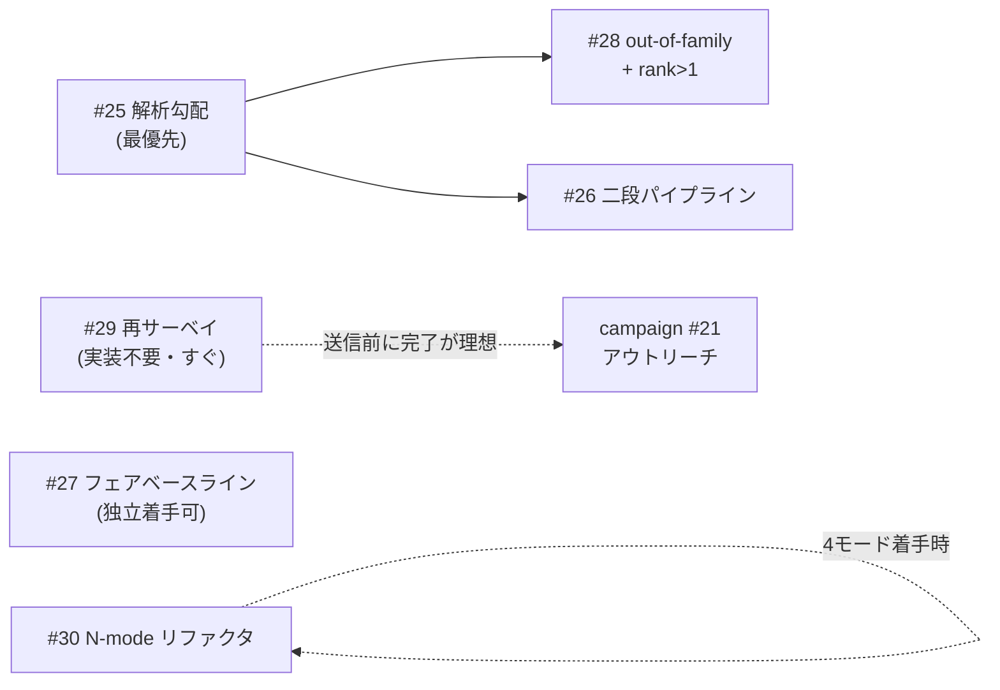

# 2026-07-12 科学面の提言 — Fable レビュー

状態: proposed(これは**提案であり決定ではない**。採否・着手順は orange が判断する)
出所: orange 依頼のリポ全体レビュー(2026-07-12、Claude Fable セッション)。配布キャンペーン([docs/2026-07-12-outreach-campaign--wip.md](2026-07-12-outreach-campaign--wip.md)、issues #18–#23)とは独立の「本務」= 科学ロードマップへの提言。

> **追記 (2026-07-13)**: 下の「前提となる現在地」の *existence result を手法に昇格* という枠組みは、その後 issue #29 の先行研究サーベイ([docs/prior-art-survey.md](prior-art-survey.md) §5) で更新された。**BB† の単独 novelty は当初想定より低い**(表現＝stellar/coherent 分解系、「物理 model-based が generic MLE に勝つ」＝Tiunov 2020 で既知、Fock-free スケーリング＝Fedotova 2022)。生き残る貢献はアルゴリズム/実証に限られ、しかも #27/#28 が既存手法に勝つ領域を実証して初めて論拠が立つ(contingent)。着手順の refine と併せ、本 PR のコメントも参照。以下の提言本文は当時の記録として保持する。

## 前提となる現在地(1段落)

スケーリング梯子は実測で確定(1モード: MLE 2倍速勝ち / 2モード: 互角・splat 7.4倍速 / 3モード: splat 両勝ち)。ただし issue #8 で 3モードの splat 優位は一部が非物理な Wigner-overlap score に支えられることが判明し、PR #15 の ρ=BB† 再パラメータ化が物理保証つき F 0.93–0.95 の **existence result** を出した。次の焦点は「existence result を手法に昇格させる」こと、およびその過程で主張の公正さを保つこと。

## 提言一覧(詳細・反証条件案は各 issue)

| # | 提言 | 一言の根拠 |
|---|---|---|
| [#25](https://github.com/orangewk/wigner-splat/issues/25) | BB† の解析勾配 | 最優先ボトルネック。FD 300–1600 s → O(10 s) 台で「物理かつ速い」が単一手法で成立。全てガウス重なり積分なので閉形式は書けるはず(splat 解析勾配化の前例と同型) |
| [#26](https://github.com/orangewk/wigner-splat/issues/26) | splat → BB† 二段パイプライン | 看板(splat)と生き残った手法(BB†)の乖離を、splat = 高速スクリーニング(稜線検出)+ BB† = 物理精錬という一貫した物語で回復 |
| [#27](https://github.com/orangewk/wigner-splat/issues/27) | 純粋状態/低ランク制約 MLE ベースライン | 現比較は逆方向に不公平(数十パラメータ純粋族 vs 26万パラメータ劣決定)。「ansatz の勝ち」か「パラメータ数制約の勝ち」かの分離。matched-objective + held-out もここで |
| [#28](https://github.com/orangewk/wigner-splat/issues/28) | out-of-family 検証 + 混合状態 (rank>1) | target-aligned な existence result を手法にする関門。rank>1 は実データ戦と dreams #5(デコヒーレンス)の前提 |
| [#29](https://github.com/orangewk/wigner-splat/issues/29) | BB† 定式化の先行研究再サーベイ | 07-06 サーベイは splat 定式化のみ対象。変分状態 ansatz + NLL は Strandberg 2022 系と近接の可能性。アウトリーチ(#21)送信前に完了が理想 |
| [#30](https://github.com/orangewk/wigner-splat/issues/30) | N-モード一般化リファクタ | 今はやらない。番号サフィックス増殖(states2/3、fit2f/3f…)は 4モード着手の号砲とセットで解消 |

このほか **issue #6(もつれコスト予想)へのコメント**として: R ~ k の下界を Gabor フレーム理論から引く短い理論 note は実装不要で単体着手可能、論文を出さない方針でも「外から見える独立成果物」として先行価値が高い、を書き残した。

## 推奨着手順と依存関係

推奨順: **#25 →(#29 と #27 は並行・独立)→ #28 → #26**。#30 はトリガー待ち。理由: #25 が通らないと #26/#28 の実験マトリクス(ターゲット × 手法 × シード)が計算的に回らない。#29 は読むだけで着手でき、campaign の品質を直接上げる。

## 既存 open issue との関係

- **#8(正定値性)**: 上記 #25–#28 はすべて #8 の長期路線(BB† 本筋)の具体化。#8 自体は「signed splat 表現の物理化可能性」という残問(full 28-param FD 未検証)を抱えたまま open が正当
- **#6(もつれコスト)**: 理論 note 提言をコメントで追記(上記)
- **#4(BLAS 再現性)**: 現状の「ドキュメント対応のみ」で十分。数値を外部に引用する場面(campaign)では単一環境値である旨の明記を README 英語化(#19)の受け入れ基準がカバー
- **#22(MLE 複数シード、campaign optional)**: #27 と同じ「統計的公正さ」系列。#22 が先に走るなら結果を #27 の設計に反映

## 検討して見送った(スコープ外にした)もの

- **論文化**: orange の方針(2026-07-12)で明示的に非ゴール。配布はキャンペーン(DOI + アウトリーチ)で代替
- **arXiv**: endorsement 問題で現状閉。アウトリーチで学者が面白がれば自然に開く扉として保留
- **GKP 診断(dreams #7)**: 提言としての起票は見送るが一言だけ — GKP の Wigner は本物の符号付きガウス格子なので、#8 の物理性 tension が最も軽い「splat 表現のまま生き残る応用先」である可能性がある。dreams に既録のため issue 化は 4モード/実データ後の判断でよい
