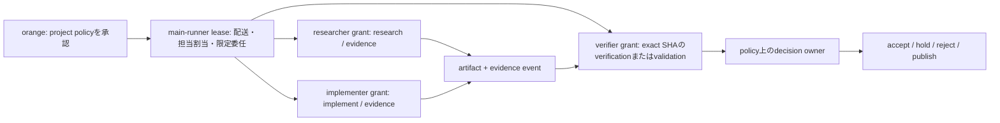
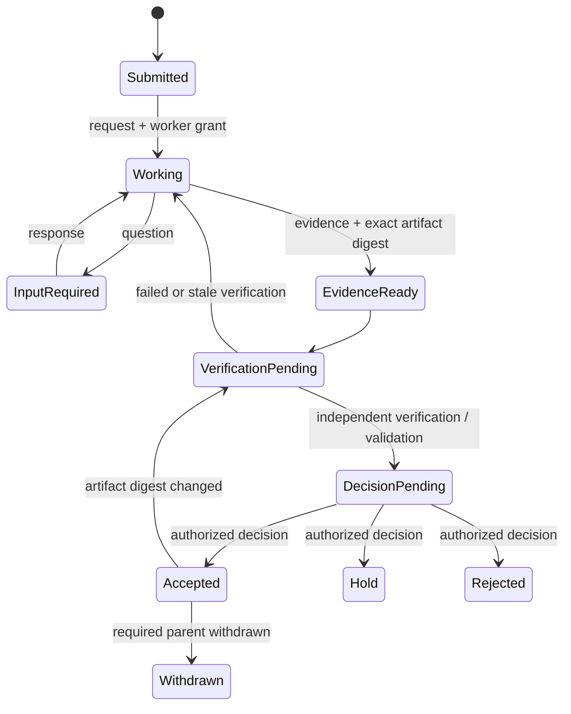

# セバスチャン責務・agent間通信の機構化案

- 状態: proposed（未実装）
- 作成日: 2026-08-01
- 決定者: orange
- 対象: ルーターランナー「セバスチャン」、引き継ぎで交代する同等ランナー、`agmsg` / Galaxiasを介して協働するagent
- 参照監査: [`../2026-08-01-sebastian-drift-audit--done.md`](../2026-08-01-sebastian-drift-audit--done.md)
- 旧案: [`2026-08-01-sebastian-governance-mechanism-v1--dead.md`](2026-08-01-sebastian-governance-mechanism-v1--dead.md)
- 目的: 内容面の助言能力を残しながら、仕様作成・検収・方向裁定・完了判定の自己承認を機械的に防ぐ

## 1. 決定案

`agmsg`を、賢い管理者や研究リーダーではなく、次の四つを扱う薄い基盤にする。

1. **配送** — 誰から誰へ何が送られ、届き、読まれたか
2. **帰属** — どのactor/sessionが、どのroleとして発行したか
3. **権限** — そのsessionが、そのtaskで、どの種類のeventを発行できたか
4. **参照** — どのartifactのexact SHA/digestを対象にしたか

研究内容の正しさ、研究路線の採否、公開判断は`agmsg`自身に決めさせない。`agmsg`は、許可された主体が必要なeventを発行したかだけを検査する。

orangeは各agentへ直接権限を発行しない。project policyを承認し、メインランナーへ期限付きの**配送・委任権限**を与える。メインランナーはpolicy内でtask限定の権限を再委任できるが、権限を拡大できない。

メインランナーは通信の関所であって、研究のリーダーではない。研究方針について`advice`を発行できるが、明示的に委任されていない`decision`、自分の成果に対する`validation` / `verification`、公開の`accept`は発行できない。

## 2. 解決する問題

監査で確認された失敗は、人格名やモデル性能だけでは説明できない。同じrunnerに次が集まった構造が問題だった。

- brief・受入条件の作成
- reviewer結果の集約
- 数学・数値・引用の検収
- PASS / HOLD / GOの裁定
- 下流runnerへの発行

さらに、GitHub投稿者とGit authorがorangeに集約され、自由記述の署名以外から実作業者を復元できない。SHAは対象版を固定するが、作業者を示さない。

本案は次を保証対象にする。

- 発言の**内容品質**と、発言が持つ**権限**を分離する。
- 有益な指摘はモデル階級にかかわらず保存できる。
- `advice`本文に「PASS」と書いても`decision`には昇格しない。
- 同じsessionが作成と検収を兼ねた場合、受理条件を満たさない。
- reviewerが確認したSHAと現在の対象SHAが違えばreviewをstaleにする。
- 引き継ぎ後も、誰が何を決められるかを自由記述から推測しない。
- privateなsession IDとpublicな作業帰属を分離する。

## 3. 非目標

- agentの推論過程やreview styleを統一しない。
- セバスチャンの内容面への発言を禁止しない。
- LLMの出力が科学的に正しいことを`agmsg`だけで保証しない。
- 初期段階でA2A server、Agent Card、NATS clusterを導入しない。
- 全taskをorangeの個別承認待ちにしない。
- hostileな同一OSユーザーから秘密を守る強固なsecurity boundaryを初期要件にしない。

初期のthreat modelは、悪意ある侵入者ではなく、agentの役割ドリフト、誤認、取り違え、古い成果の再利用、自己検収である。

## 4. 世間の設計から移入する部分

一つの製品を移入するのではなく、層ごとに既存知見を使う。

### 4.1 A2Aから語彙を借りる

[A2A Protocol](https://a2a-protocol.org/latest/specification/)から`context_id`、`task_id`、`message / parts`、`artifact`、task lifecycleを取り入れる。

A2A完全準拠は目指さない。A2Aの`role`は主に`user` / `agent`であり、複数runnerの帰属や権限を表すには不足する。またA2Aはcriticalな情報の確実なmessage保存を保証しないため、durable mailboxの代替にはならない。

### 4.2 runtime内orchestrationは移入しない

[OpenAI Agents SDK](https://openai.github.io/openai-agents-python/multi_agent/)のhandoff / agents-as-toolsや、[AutoGen Core](https://microsoft.github.io/autogen/stable/user-guide/core-user-guide/framework/message-and-communication.html)のdirect message / pub-subは、同一runtime内の協働には有効である。

しかし、複数vendorの独立CLI sessionと引き継ぎをまたぐ`agmsg`の境界とは異なる。特にmanager agentをfinal ownerにする方式は、本件で除外する構造を再導入するため採用しない。

### 4.3 artifactを本文経由で再記述しない

[Anthropicのmulti-agent research system](https://www.anthropic.com/engineering/multi-agent-research-system)が示すように、大きなsubagent出力は外部artifactへ保存し、coordinatorには参照だけ返す。これにより伝言ゲームと再記述時の意味変化を減らす。

### 4.4 durable queueは必要時だけ交換する

[NATS JetStream](https://docs.nats.io/nats-concepts/jetstream/consumers)は保存、ACK、再送、durable consumer、replayを提供する。将来の配送backend候補にはなるが、agentのroleや科学的権限は扱わない。

当面はSQLiteを正本とする。複数hostの競合、再送、availabilityが実害になった時だけ、`agmsg` CLIを保ったままbackendを交換する。Git JSONL busは監査・持ち運びには使えるが、リアルタイム配送の唯一の正本にはしない。

## 5. 用語

- **actor**: 実際の実行主体。vendor、model、runner種別を含められる。
- **session**: actorの一つの実行session。roleの人格名とは別物。
- **role**: `main-runner`、`router`、`researcher`、`implementer`、`verifier`等の職務。
- **grant**: sessionが特定taskで発行できるevent種類を示す期限付き権限。
- **event**: append-onlyに保存される構造化された行為記録。
- **message**: 人間・agentが読む依頼、質問、助言、状況連絡。
- **artifact**: code、計算結果、report、論文、review等の成果物。
- **verification**: 実装が仕様どおりか、再現するかの確認。
- **validation**: 科学的主張、数式、数値、引用が妥当かの確認。
- **decision**: evidence / verification / validationを受け、採否・保留・公開を決める行為。

`verification`、`validation`、`decision`を「検収」や「PASS」の一語へ畳まない。

## 6. 権限モデル

### 6.1 orangeの関与点

orangeが関与するのはmessageごとではなく、次の三箇所とする。

1. project policyと初期メインランナーの承認
2. policy外の例外、研究目的・受入条件の高影響な変更
3. public release、mainへの昇格、権威ある科学的主張の採用など不可逆な出口

routine taskは、policyで指定されたdecision ownerまたは機械的なacceptance ruleへ委任できる。

### 6.2 再委任は縮小だけを許す



子grantは親grantについて次をすべて満たす。

- capability集合が親の部分集合である。
- 対象task / artifact / branchが同じか、より狭い。
- 有効期限が親以下である。
- 親に`delegate`がなければ再委任できない。
- 親が持たない`decision` / `publish` / `validate`を追加できない。
- `forbidden`を削除できない。

### 6.3 メインランナー交代

orangeが引き継ぎのたびに新sessionへ手動発行することは求めない。

- 現メインランナーは、project policyが許す範囲で、後継sessionへ**配送・限定委任lease**を移譲できる。
- 科学的`decision`や`publish`権限はhandoffに自動追随しない。
- 旧leaseはhandoff完了時に失効する。
- handoff chainが切れた場合だけorangeが再bindする。
- handoff eventには旧session、新session、policy digest、未解決taskを記録する。

## 7. authority matrix

| 行為 | orange | メインランナー / router | worker | 独立verifier |
|---|---|---|---|---|
| project policy承認 | 可 | 不可 | 不可 | 不可 |
| task作成・担当割当 | 可 | policy内で可 | 原則不可 | 原則不可 |
| task限定grant発行 | 可 | 親grant内で可 | `delegate`時のみ | `delegate`時のみ |
| request / status / question | 可 | 可 | 可 | 可 |
| advice / evidence | 可 | 可 | 可 | 可 |
| 自作artifactのverification / validation | 不採用 | 不採用 | 不採用 | 不採用 |
| 他者artifactのverification / validation | 委任時のみ | 独立grant時のみ | 独立grant時のみ | grant範囲で可 |
| acceptance criteria変更 | 可 | proposalのみ | proposalのみ | proposalのみ |
| accept / hold / reject | 可 | decision grant時のみ | 不可 | 原則recommendationのみ |
| publish / main昇格 | 可 | 明示grant時のみ | 不可 | 不可 |

「不採用」は発言を禁止する意味ではない。自己検算を`advice` / `evidence`として保存できるが、独立gateの枚数へ数えない。

## 8. event種類

- `request`: taskの依頼・追加作業の依頼
- `question`: 不明点・入力要求
- `status`: 進行状況。採否を含まない
- `advice`: 指摘・仮説・方向提案。未批准
- `evidence`: 出典、計算、test結果、artifact参照
- `verification`: 実装・再現性についての独立確認
- `validation`: 科学的内容についての独立確認
- `decision`: `accept` / `hold` / `reject` / `publish`
- `withdrawal`: 過去eventまたはclaimの撤回
- `handoff`: role leaseと未解決taskの引き継ぎ
- `receipt`: delivery / read / process ACK

本文中の「通過」「GO」「確認済み」は表示文字にすぎない。UIや公開記録が示すverdictは、構造化された`decision` eventと必要な親eventから計算する。

## 9. schema案

### 9.1 event envelope

```json
{
  "schema_version": "agmsg-event/0.1",
  "event_id": "uuid",
  "team": "wigner-splat",
  "context_id": "issue-126",
  "task_id": "exp27-row1",
  "event_type": "evidence",
  "actor": {
    "role": "researcher",
    "actor_id": "private-stable-id",
    "session_id": "private-session-id",
    "vendor": "openai",
    "runner": "codex"
  },
  "recipient": { "role": "verifier" },
  "grant_id": "grant-uuid",
  "in_reply_to": ["event-uuid"],
  "parts": [{ "type": "text", "text": "再現結果を提出する" }],
  "artifact_refs": [{
    "uri": "git:experiments/27_row1_classical/RUN_REPORT.md",
    "git_commit": "b89f9dc...",
    "content_digest": "sha256:...",
    "media_type": "text/markdown"
  }],
  "created_at": "2026-08-01T00:00:00Z",
  "metadata": {}
}
```

必須規則:

- `event_id`はglobalに一意でappend-only。
- `actor.session_id`はagentの自己申告でなくruntime bindingから注入する。
- `verification` / `validation` / `decision`はexact commitとdigestを必須にする。
- `in_reply_to`で依頼、証拠、検証、裁定をDAGとして結ぶ。
- artifact本文をmessageへ複製しない。
- 対象artifactが更新されたら旧verification / validationは`stale`になる。

### 9.2 capability grant

```json
{
  "grant_id": "grant-uuid",
  "issuer_session_id": "main-runner-session",
  "subject_session_id": "worker-session",
  "task_id": "exp27-row1",
  "capabilities": ["request", "status", "advice", "evidence"],
  "forbidden": ["decision", "publish", "verify-own-artifact"],
  "artifact_scope": ["git:experiments/27_row1_classical/**"],
  "parent_grant_id": "main-runner-lease",
  "policy_digest": "sha256:...",
  "expires_at": "2026-08-02T00:00:00Z"
}
```

初期実装では公開鍵署名を必須にしない。DB上のsession binding、unguessable token、append-only grant chainで役割ドリフトを防ぐ。敵対的な同一OS processまで防ぐ必要が生じたら、OS principal分離、container分離、署名付きstatementを別段階で導入する。

## 10. 現行`agmsg`とのギャップ

2026-08-01時点のinstalled copyを確認した。

- `messages` tableは`team / from_agent / to_agent / body / created_at / read_at`が中心である。
- remote syncは`uuid / origin`を追加し、JSONLをunion-by-UUIDで同期する。
- `send.sh`は`from_agent`を引数で受け、team rosterに存在する名前かを確認するが、呼出processと送信者を結合しない。
- `--force`はroster membershipを迂回できる。
- `role-session` recordは実装コメント上もadvisory、best-effort、safe-to-deleteであり、権限根拠にはできない。

したがって、既存`body`に`authority: decision`と書くだけの変更は禁止する。任意のregistered roleを名乗れる現状では、権限欄も自己申告になる。

最初に必要なのは、`from_agent`をagent入力から受け取らず、session tokenから解決する送信者bindingである。

## 11. 保存モデル

既存free-form mailboxを壊さず、構造化eventを追加する。

- `messages`: legacy messageと人間向け配送viewを維持する。
- `events`: authoritativeなappend-only envelopeを保存する。
- `sessions`: runtimeが確認したactor/session/role bindingを保存する。
- `grants`: capability chainを保存する。
- `deliveries`: recipientごとのdelivery / read / process ACKを保存する。

`messages`と`events`へ同じclaimを別々に手書きしない。人間向けmessageはeventから生成するか、messageがeventへの参照だけを持つ。

現行の`role-session` fileはresume用途として残せるが、authority判定では`sessions` tableと有効tokenだけを見る。

## 12. task状態とgate



gate規則:

1. author sessionとverifier sessionが同じなら独立gateに数えない。
2. spec / acceptance criteriaを変更したsessionは、その版の独立verifierになれない。
3. exact SHA/digestが変われば既存reviewをstaleにする。
4. `decision`は必要なevidence / verification / validation eventを`in_reply_to`で参照する。
5. 依存eventがwithdrawnになれば依存decisionを再評価する。
6. routerの`advice`をgate数へ加算しない。
7. 完了表示はbody文字列ではなく状態遷移から生成する。

## 13. public / private projection

privateな`agmsg` storeにはactor/session ID、vendor/model/runner、local path、grant chain、ACK、private artifact URIを保持する。

GitHub等のpublic面へはrole、activity/event type、対象Git SHAまたはdigest、review/validation ref、decision ref、epistemic statusだけを投影する。

private session IDをpublic commentへ出さない。公開文面は構造化eventから生成し、agentが署名行を手書きしない。

## 14. セバスチャンへの適用

セバスチャンは人格名ではなく`router` roleの一インスタンスとして扱う。

許可すること:

- task分解、担当割当、配送
- 進捗、依存関係、未解決点の記録
- 証拠不足、主張衝突、scope driftの指摘
- 追加調査、再計算、保留の`advice`
- verifier / decision ownerが発行したeventの転送と要約

独立gateとして数えないこと:

- 自分が作成・変更したbriefの検収
- reviewer出力を自分で再検算した結果
- 自分の数式・数値確認
- 自分が追加した受入条件の通過判定
- 「直れば即発行」等の発行裁定

セバスチャンの指摘が正しければ、別主体が対象SHAを確認し、`verification` / `validation`として採用する。発言を捨てず、権限だけを分離する。

## 15. 導入計画

### Phase 0 — 本設計の確認

- authority matrix、event語彙、orangeの関与点を確定する。
- canonical `agmsg` source repositoryを特定する。installed skill copyをauthoring locationにしない。
- 初期threat modelが非敵対的なrole drift防止でよいか確認する。

### Phase 1 — session binding

- session IDとtokenを発行し、token hashとactor/role/session bindingをDBへ保存する。
- `send`は`from_agent`を引数から採用せずtokenから解決する。
- manual/admin overrideは別commandにし、override eventを必ず残す。
- authority eventではlegacy `--force`を拒否する。

### Phase 2 — event / grant schema

- `events / sessions / grants / deliveries`をadditive migrationで追加する。
- A2A由来の`context_id / task_id / parts / artifact_refs`を実装する。
- grant attenuation、expiry、task scopeをwrite時に検査する。
- legacy messageを引き続き送受信できるようにする。

### Phase 3 — gate policy

- 自己verification / validationを独立gateへ数えない。
- stale SHA、欠落digest、無権限decisionを拒否する。
- withdrawalと依存decisionの再評価を実装する。
- verdictをevent graphから生成する。

### Phase 4 — wigner-splat pilot

- `exp/27-row1-numerics`を記録方式のpilotにする。
- 既存の科学成果やHOLD判断は変更しない。
- researcher / verifier / decision ownerを別sessionへ割り当てる。
- exact SHA、evidence、review、decisionの一往復を記録する。

### Phase 5 — projection / observability

- GitHub commentやtask reportをeventから生成する。
- public/private projectionをtestする。
- 必要ならMLflow等へtrace IDを送るが、trace backendをauthority sourceにしない。

### Phase 6 — 三task後の評価

- 権限違反とstale reviewを止めた件数
- 有益なadviceの採用率
- orangeの追加確認回数
- task完了時間とmessage量
- handoff時の復元成功率

摩擦が便益を上回る項目を削る。NATSやA2A serverの導入判断もここまで保留する。

## 16. acceptance criteria

1. registered role名を知っていても、別sessionがそのroleとしてauthority eventを送れない。
2. メインランナーがworker / verifierへtask限定grantを発行できる。
3. 子grantが親より広いcapability、scope、expiryを持てない。
4. メインランナーのadvice本文に「PASS」とあってもtaskがacceptedにならない。
5. artifact authorと同じsessionのverificationを独立gateへ数えない。
6. review後にartifact digestが変わるとreviewがstaleになる。
7. 必要なvalidationなしのdecisionを拒否できる。
8. withdrawn evidenceに依存するdecisionを有効表示し続けない。
9. main-runner handoff後に旧leaseがauthority eventを発行できない。
10. legacy free-form messageの送受信が壊れない。
11. public projectionにprivate session IDやlocal pathが出ない。
12. 完了表示がstructured decisionから生成される。

## 17. リスク

### High — session bindingを権限と誤認する

同じOS userで動くprocess間ではtoken窃取まで防げない場合がある。初期実装はrole driftと誤操作を防ぐprovenance controlであり、敵対的security boundaryではない。

### High — メインランナーが再び意味上のleaderになる

担当割当と配送権限があるため、promptだけでは内容裁定へ戻りうる。write-time policyで`advice`と`decision`を分け、router grantに科学的validationを含めない。

### Medium — schemaが科学研究専用へ過適合する

coreはtask、artifact、event、grantに限定する。科学固有の`validation` policyはteam profileにする。

### Medium — Git JSONLとの後方互換

schema versionを持たせ、旧`message_sent`をimportできる期間を設ける。二重authoringを避け、projectionを一方向にする。

### Medium — handoff chainの破損

lease expiry、current ownerの一意性、旧owner失効をtransactionで扱う。復旧時だけorangeの再bindを要求する。

### Low — 運用が重くなる

すべての会話をauthority eventにしない。日常会話はlegacy message、gateへ関係する行為だけstructured eventにする。

## 18. 複雑度と変更境界

- 複雑度: **高**（identity bindingとmigrationが中心）
- 初期pilot: **中**（team opt-in、single-host SQLite、非敵対的threat modelに限定）
- 主な変更先: canonical `agmsg` repository
- 消費側変更: Galaxiasのrunner binding、wigner-splatのpilot policy / generated record
- 本書承認だけでは実装を開始しない。Phase 1着手前に変更repo、branch/worktree、migration方針を別途確認する。

## 19. 本設計で不要になるもの

- 役割名だけの手書き署名を権限証明として扱うこと
- `PACKET.json`へ同じclaimを手作業で再記述する案
- routerがreviewer出力を再検算してgateを一枚増やす運用
- body中の「PASS / GO」を機械判定する処理
- orangeが全agentへ個別に権限を発行する運用
- 初期段階でのmanager-agent framework全面移入

役割名「執事」は認知的な合図として残してもよいが、機構上の権限はsession binding、grant、event type、artifact digestだけから判定する。
