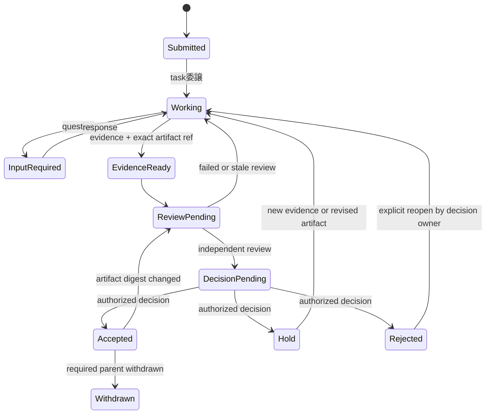

# セバスチャン責務・agent間協働の機構化案

- 状態: superseded（科学policy部分のみ新設計へ継承）
- 作成・改訂日: 2026-08-01
- 決定者: orange
- 対象: セバスチャンおよび、引き継ぎで交代する同等runner
- 参照監査: [`../2026-08-01-sebastian-drift-audit--done.md`](../2026-08-01-sebastian-drift-audit--done.md)
- 旧案: [`2026-08-01-sebastian-governance-mechanism-v1--dead.md`](2026-08-01-sebastian-governance-mechanism-v1--dead.md)
- 後継設計: [`2026-08-02-github-native-agent-governance--proposed.md`](2026-08-02-github-native-agent-governance--proposed.md)
- 再発明評価: [`../2026-08-02-agent-provenance-reinvention-assessment--done.md`](../2026-08-02-agent-provenance-reinvention-assessment--done.md)

> 本書の手書きprovenance schema、task状態機械、Phase 1 / 2計画は停止した。
> セバスチャン監査から導いた科学的authority境界は後継設計へ移した。

## 1. 決定

新しいidentity service、relay、全体を統べるauthority databaseは作らない。

既存基盤を用途ごとに使う。

1. 成果物の正本: Git commitとcontent digest
2. 遠隔共有する証拠・review・decisionの正本: GitHub Issue / PR / review
3. 単一PC内の配送状態の正本: 現行`agmsg`のSQLite
4. vendor会話の索引: Codex task / thread / turn、Claude session等のID

一つのglobalな正本へ統合しない。各claimにはauthoring locationを一つだけ定め、別の面には本文を複写せず参照を置く。

最初に機構化するのは暗号学的本人確認ではない。

- 作成、review、裁定を別activityとして記録する。
- 独立reviewを、session名ではなくactor、委譲経路、対象SHAから判定する。

クラウドrunnerは当面GitHubを共有mailbox兼監査記録として使う。PC上のSQLiteへ接続する独自relayは置かない。GitHubでは遅すぎる実害が確認された場合だけ、Ably等のhosted messagingを`agmsg` transportとして評価する。

## 2. 解決する問題

監査では同じrunnerへ次が集まっていた。

- brief・受入条件の作成
- reviewer結果の集約
- 数学・数値・引用の検収
- PASS / HOLD / GOの裁定
- 下流runnerへの発行

GitHub投稿者とGit authorもorangeへ集約され、自由記述の役割署名以外から実作業者を復元できなかった。SHAは「どの版か」を示すが「誰が何をしたか」を示さない。

本案は次を保証対象にする。

- 内容品質とauthorityを分離する。
- routerの本文に「PASS」とあってもdecisionにはしない。
- 同じactorが新sessionを開いても自己reviewを独立扱いしない。
- authorが自分でreviewerを委譲しても独立扱いしない。
- review対象SHAが変わればreviewをstaleにする。
- HOLDへ新証拠を追加して再開できる。
- PC外runnerもGitHubからtaskを復元できる。

## 3. threat modelと非目標

初期のthreat modelは、悪意ある侵入者ではなく、役割ドリフト、自己検収、取り違え、古い成果の再利用、引き継ぎ時の誤認である。

初期段階では次を目標にしない。

- 科学的正しさを通信基盤だけで保証する。
- agentの推論過程やreview styleを統一する。
- 同じOS user内の敵対processやtoken窃取を防ぐ。
- vendorをまたいだagent同一性を暗号学的に証明する。
- A2A server、SPIFFE / SPIRE、NATS cluster、Entra Agent IDを導入する。
- 全messageをstructured eventへ変換する。
- 全taskをorangeの個別承認待ちにする。

強いidentityが必要になった場合は、role drift対策と分けてsecurity設計を行う。

## 4. 世間から移入する部分

### 4.1 A2Aから語彙だけ借りる

[A2A Protocol（commit `2cdf197`）](https://github.com/a2aproject/A2A/blob/2cdf197805cf3eb780714f730cdfd24bce1c9998/docs/specification.md)の`contextId`、`taskId`、`Message`、`Artifact`、task lifecycleを参照する。本projectのprovenance fieldでは既存規約へ合わせ、`context_id`、`task_id`のsnake_case表記へ正規化する。

A2A serverは運用しない。Agent Cardは能力と認証方式を宣言できるが、本projectのreview独立性やdecision authorityを発行するものではない。

### 4.2 vendor IDは索引にする

Codex task / thread / turn、Claude session等のIDは、元会話を探す`vendor_ref`として保存する。同じrunnerが新sessionを作れるため、identity証明や独立性判定には使わない。

publicでないIDやURLはGitHubへ出さず、privateな`agmsg`記録またはvendor側へ置く。

### 4.3 hosted messagingは必要後に移入する

[Ably token authentication](https://ably.com/docs/auth/token/)は、短命tokenへ固定`clientId`とchannel限定capabilityを付けられる。[identified clients](https://ably.com/docs/auth/identified-clients)では発行側がmessage送信者を固定できる（一次資料確認: 2026-08-01）。service仕様は変わり得るため、現時点の候補機能として扱い、採用判断時に再確認する。

次が三task以上で再現した場合だけ候補にする。

- GitHubの遅延、polling、rate limitでremote往復が停止する。
- privateな低遅延messageを複数host間で配送する必要がある。

採用してもAblyはtransportと一時client identityだけを担当する。科学的authorityは委ねない。

## 5. 用語

- **actor**: project内で追跡する作業主体。session再開やcompactionでは同じ`actor_id`を使い、別runnerへのhandoffでは新しいactor IDへ変える。
- **run**: actorの一回の実行。vendor sessionやcloud taskに対応する。
- **role**: `main-runner`、`router`、`spec-owner`、`researcher`、`implementer`、`verifier`等の職務。
- **activity**: `advice`、`authoring`、`verification`、`validation`、`decision`等、その記録で行ったこと。
- **delegation chain**: 誰が誰へその作業を渡したか。
- **artifact**: code、計算結果、report、論文、review等の成果物。
- **verification**: 実装が仕様どおりか、再現するかの確認。
- **validation**: 科学的主張、数式、数値、引用が妥当かの確認。
- **decision**: 証拠とreviewを受け、採否・保留を決める行為。
- **vendor ref**: vendor上の元実行を探す索引。identity証明ではない。

`verification`、`validation`、`decision`を「検収」や「PASS」の一語へ畳まない。

## 6. 最小provenance record

GitHub comment、review、委譲brief、成果報告には本文と分けて次を残す。

```yaml
provenance:
  actor_id: claude-reviewer-01
  activity: validation
  delegated_by: main-runner
  delegation_chain: [main-runner, claude-reviewer-01]
  handoff_from: []
  artifact:
    git_commit: b89f9dc...
    artifact_scope: [experiments/27_row1_classical/results.json]
    content_digest: sha256:...
  based_on: [https://github.com/orangewk/wigner-splat/issues/126]
  epistemic_status: reported
  vendor_ref: private
```

必須field:

- `actor_id`
- `activity`
- `delegated_by`またはorangeによる直接実行の表示
- `delegation_chain`（`verification` / `validation`では必須。ただし`delegated_by`の記録グラフから一意に導出できる場合は省略可）
- `handoff_from`（handoffでなければ空list）
- 対象artifactのexact commitまたはcontent digest
- `artifact_scope`（同じcommitに複数actorの成果が入る場合は対象pathまたはcontent digest）
- `reported / proposed / verified / validated / decided / withdrawn`の`epistemic_status`

`activity`はactorが行った行為、`epistemic_status`はその記録が運ぶclaimを現在どう扱うかを示す。たとえば`activity: validation`かつ`epistemic_status: reported`は「validation結果が提出されたが、独立gateへ採用済みとはまだ扱わない」という意味である。

`handoff_from`は全記録で必須とし、handoffでなければ空list、handoff記録では旧actorから現在actorまでを追跡できる非空の祖先listとする。これによりfieldの書き忘れと「handoffなし」を区別する。`based_on`は親記録のURLまたはdigestを持ち、`decision` / `withdrawal`では必須、`verification` / `validation`が以前のevidenceを採用する場合にも必須とする。

過去の記録にactor、delegation、handoff、対象digestがない場合、placeholderをこれらのfieldへ埋めて現行schemaへ再署名しない。代わりにsource URLと欠損fieldを持つ`provenance_completeness: incomplete`のlegacy projectionとして記録し、独立gateには数えない。

Git commitのauthor / committerをcommit内の全artifactのauthorとみなさない。brief、生成物、packagingが同一commitに入る場合は、activityごとに同じcommitと異なる`artifact_scope`を参照する。

`vendor_ref`は取得できる場合だけprivateに保存する。これは電子署名ではなく、偶発的な役割混同を可視化するactivity stampである。「執事」等の役割名だけを署名として使わない。

## 7. actorと独立性

### 7.1 actorの割当

- orangeは各workerへactor IDを手動発行しない。
- orangeが承認したメインランナーが委譲briefへ一意な`actor_id`を記録する。
- session再開やcompactionではactor IDを変えない。別runnerへhandoffする場合は新しいactor IDを割り当て、`handoff_from`で旧actorを参照する。
- 別actor IDを付けても、旧actorから自己委譲したreviewは独立とみなさない。
- vendor名、model名、role名だけをactor IDにしない。

### 7.2 独立reviewの条件

すべてを満たす場合だけ独立reviewとして数える。

1. reviewerのactor IDがartifact authorと異なる。
2. reviewerのdelegation chainにartifact authorが含まれない。
3. reviewerが対象版のspecまたはacceptance criteriaを作成・変更していない。
4. reviewがexact artifact SHA/digestと`artifact_scope`を指定し、それらが判定時点の対象版と一致する。
5. activityが`verification`または`validation`である。
6. reviewerの`handoff_from`祖先にartifact authorが含まれない。

session、vendor、モデルが異なることや、本文の「独立review」表記だけでは不足する。メインランナーはauthorとreviewerを別々に直接委譲できるが、authorは自分のreviewerを委譲できない。

## 8. authority matrix

| 行為 | orange | メインランナー / router | spec-owner | worker | 独立verifier |
|---|---|---|---|---|---|
| project policy承認 | 可 | 不可 | 不可 | 不可 | 不可 |
| task作成・担当割当 | 可 | policy内で可 | 原則不可 | 原則不可 | 原則不可 |
| worker / reviewerへの委譲 | 可 | policy内で可 | 明示された再委譲のみ | 同左 | 原則不可 |
| request / status / question | 可 | 可 | 可 | 可 | 可 |
| advice / evidence | 可 | 可 | 可 | 可 | 可 |
| 自作artifactのverification / validation | 独立gateに不採用 | 同左 | 同左 | 同左 | 同左 |
| 他者artifactのverification / validation | 委任時のみ | 独立条件を満たす時のみ | 同左 | 同左 | 委譲範囲で可 |
| routineなacceptance criteria明確化 | 可 | proposalのみ | 委譲範囲で可 | proposalのみ | proposalのみ |
| 高影響なacceptance criteria変更 | 可 | proposalのみ | proposalのみ | proposalのみ | proposalのみ |
| accept / hold / reject | 可 | 明示decision owner時のみ | 同左 | 不可 | 原則recommendationのみ |
| publish / main昇格の決定 | 可 | 不可 | 不可 | 不可 | 不可 |
| orange決定済みpublishの実行 | 可 | 明示委譲時のみ | 不可 | 不可 | 不可 |

task作成時に、必要なtaskだけimplementerとは別の`spec-owner`を指定する。routineな明確化とは、承認済みの研究目的と証拠水準を緩めず、判定手順を具体化する変更をいう。研究目的、証拠水準、公開claim、public / private境界を変える変更は高影響としてorangeへ戻す。spec-ownerが変更した版を同じactorが独立reviewすることはできない。spec-ownerをdecision ownerに明示しても§7.2の独立review gateは免除されず、decisionはそのreviewを`based_on`で参照する。

`delegate`はactivityではなく再委譲可能範囲を示すcapabilityとする。task、artifact scope、期限、authorityを親から拡大できない。

publish authorityはorangeだけが発生させる。メインランナーは記録済みorange decisionを実行できるが、自分でpublish decisionを作らない。

## 9. activity語彙

- `request`: taskまたは追加作業の依頼
- `question`: 不明点・入力要求
- `status`: 進行状況。採否を含まない
- `advice`: 指摘・仮説・方向提案。未批准
- `authoring`: brief、code、report、acceptance criteria等の作成・変更
- `evidence`: 出典、計算、test結果、artifact参照
- `verification`: 実装・再現性の独立確認
- `validation`: 科学的内容の独立確認
- `decision`: `accept / hold / reject`
- `publish-execution`: 記録済みorange decisionの実行
- `withdrawal`: 過去記録またはclaimの撤回
- `handoff`: actor責任と未解決taskの引き継ぎ
- `receipt`: delivery / read / process ACK

本文中の「通過」「GO」「確認済み」は表示文字にすぎない。

## 10. 保存場所と配送

### 10.1 単一PC

- free-form messageとread状態は、ユーザー環境で共有する現行`agmsg` SQLiteへ保存する。
- SQLiteはそのPC・ユーザー内のmailbox正本であり、個別projectのauthority sourceではない。messageはteam / actor間で配送し、projectとの対応はagent registrationで解決する。
- gateに使うartifact、review、decisionはGitまたはGitHubの参照を持つ。
- `agmsg`のversion / commitはPC側の運用環境inventoryに置き、各taskのprovenanceへ複写しない。
- `agmsg`へ同じclaimを再記述せず、正本URLまたはartifact refを送る。

### 10.2 PC外のrunner

- GitHub Issue / PR / reviewをremote mailbox兼durable recordとして使う。
- artifactはbranch / commit / PRで渡す。
- reviewは対象commitを指定して投稿する。
- local SQLiteとの同期をremote taskの前提にしない。

public GitHubを使えるのは、[`2026-07-25-public-private-layer-separation--recorded.md`](../2026-07-25-public-private-layer-separation--recorded.md)の境界を満たすtaskだけである。第三者が本人の同意なく登場するtaskは、private repositoryまたはvendor側の非公開taskを使い、public Issueを既定経路にしない。

この段階では別の身分証を発行しない。GitHub上の投稿主体、activity stamp、delegation record、対象SHAを組み合わせて帰属を記録する。

### 10.3 将来のrealtime transport

GitHub不足が三task以上で再現した場合だけhosted transport adapterを追加する。第一候補はAblyとする。

- main-runnerがtask限定・短命tokenを発行し、orangeは個々のagentへ発行しない。
- tokenの`clientId`をactor IDへ対応させる。
- channelをproject / task単位に限定する。
- transport履歴をdecisionの正本にしない。
- A2A由来のmessage / task / artifact refを保ち、transportを交換可能にする。

## 11. 現行`agmsg`についての証拠境界

Phase 0でcanonical sourceを[`fujibee/agmsg@caed5a4`](https://github.com/fujibee/agmsg/commit/caed5a461eb0cfd373188545351f79dd56f13fb8)へ固定した。ただしinstalled `VERSION`とtagの対応だけではinstalled tree全体のbyte同一性を証明しない。この固定版はgap analysis用の運用環境inventoryであり、project taskのauthority sourceではない。

本設計は`agmsg`の内部schemaやidentity保証へ依存しない。必要なのはtask URL、artifact ref、request / status / receiptを配送できることだけであり、durableなreviewとdecisionはGit / GitHubへ置く。

## 12. task状態とgate



gate規則:

1. 独立reviewには§7.2の全条件を満たす記録だけを採用する。artifact SHA/digestの変更後は条件4不成立としてreviewをstaleにする。
2. routerのadviceや自己検算をgateへ加算しない。
3. decisionは`based_on`で必要なevidence / verification / validationを参照する。
4. 依存記録がwithdrawnなら`based_on`を辿ってdecisionを再評価する。
5. HOLDは終端でなく、新証拠または改訂artifactでWorkingへ戻せる。
6. REJECTEDは元decision ownerの明示的reopenで再開できる。
7. 完了表示は本文でなく状態遷移から生成する。

独立な実行経路を主張するtaskでは、自由記述ラベルを判定に使わない。task固有のacceptance checkerまたはpolicy testが、実行entry point、実行code digest、到達したcall target、入力digestを記録・比較する。この検査は`agmsg` transportではなく、対象実験またはrepository testの責務とする。

## 13. public / private projection

public面にはactor label、activity、epistemic status、対象SHA/digest、evidence / review / decision ref、必要なdelegation refだけを出す。

privateなvendor session ID、local path、secret、未公開artifact URIは出さない。同じclaimを手書きで複製しない。

監査報告から本設計へのforward linkは、監査報告を別変更するときに追加する。本設計から監査へのbacklinkは冒頭に置いた。

## 14. セバスチャンへの適用

セバスチャンは研究leaderではなく、主に`router` activityを担うactorとする。

許可すること:

- task分解、担当割当、配送
- 進捗、依存関係、未解決点の記録
- 証拠不足、主張衝突、scope driftの指摘
- 追加調査、再計算、保留のadvice
- 原典を置換しないreview / decisionの転送と要約

独立gateとして数えないこと:

- 自分が変更したbriefの検収
- reviewer出力を自分で再検算した結果
- 自分の数式・数値確認
- 自分が追加した受入条件の通過判定
- 「直れば即発行」等の発行裁定

指摘が正しければ別actorが対象SHAを確認し、verificationまたはvalidationとして採用する。役割名「執事」は認知的合図として残してよいが、provenance、独立性、authorityの代わりにはしない。

## 15. 導入計画

### Phase 0 — record-only pilot

[Issue #143](https://github.com/orangewk/wigner-splat/issues/143)で完了・accept済み。

- canonical `agmsg`はproject recordでなくPC側の運用環境inventoryへ分離した。
- #126 / `b89f9dc`はtaskとartifactまで復元できたが、actor、review対象版、artifact decisionは復元不能だった。
- legacy記録は現行actorへ再署名せず、欠損を明示して独立gate不採用とした。

### Phase 1 — 三taskで運用

[Issue #146](https://github.com/orangewk/wigner-splat/issues/146)で追跡する。

- authorとreviewerをメインランナーから別々に委譲する。
- exact SHAと`artifact_scope`付きのevidence、review、decisionを記録する。
- HOLDから新証拠による再開を試す。
- cloud runnerを使うtaskをGitHubだけでhandoffできるか確認する。

### Phase 2 — 最小の機械チェック

pilotで有効だった規則だけをcheckerまたはGitHub templateへ実装する。

- 必須provenance fieldの欠落
- §7.2の全独立性条件の成否（checkerは条件一覧を別定義せず参照する）
- decision / withdrawalの`based_on`欠落
- review SHAとcurrent headの不一致
- 独立経路claimに対するentry point / code / call target / input digestの欠落
- router adviceをdecisionとして数える誤り
- orange由来でないpublish decision

`agmsg`全面migration、session token、grant tableは必須にしない。

### Phase 3 — remote transport判定

GitHub待ちの停止時間、取りこぼし、private remote message件数、orangeの追加操作、帰属復元失敗を測る。同じdelivery問題が三task以上で再現した場合だけAbly adapterを設計する。

## 16. acceptance criteria

1. 誰がauthoring / advice / verification / validation / decisionを行ったか区別できる。
2. §7.2のいずれかの条件を満たさないreviewを検出し、独立reviewに数えない。
3. artifact digest変更後のreviewをstaleにできる。
4. router本文の「PASS」でtaskがacceptedにならない。
5. HOLDへ新evidenceを追加してWorkingへ戻せる。
6. orange由来の記録を欠くpublish / main昇格decisionを検出し、採用しない。
7. PC外runnerがGitHubだけからtask、artifact、review対象を復元できる。
8. vendor IDがなくても運用でき、あればprivateな索引として残せる。
9. local free-form messageを壊さない。
10. 同じclaimをGit、GitHub、agmsgへ別々に手書きしない。
11. pilotに新しい常駐serviceやidentity providerを要しない。
12. decisionとwithdrawalから`based_on`を辿り、親記録を復元できる。
13. 独立経路claimをentry point、code digest、call target、input digestで検査できる。
14. 同一commitに複数actorの成果がある場合、`artifact_scope`で対象を区別できる。

## 17. リスク

- **High — 記録を強いidentityと誤認する**: activity stampはprovenance controlであり、敵対的ななりすましを防ぐsecurity boundaryではない。
- **High — メインランナーが再びleaderになる**: routerの自己検算はadviceに固定し、独立gateへ数えない。
- **Medium — GitHubが遅い**: まず停止時間を測り、反復時だけhosted transportを加える。
- **Medium — actor IDを付け替える**: session差だけでなくdelegation chainも確認する。敵対的偽装が現実化した場合だけOIDC等を別設計する。
- **Medium — private ID漏洩**: vendor refとlocal pathをprivate fieldに限定する。
- **Low — 記録負荷**: artifact作成、review、decision、handoff等、authority判断へ使う記録だけを対象にする。

## 18. 複雑度と変更境界

- 初期複雑度: **低**（templateと運用pilot）
- 初期infra変更: **なし**
- 初期DB migration: **なし**
- 初期remote transport: **GitHub**
- optional transport: **Ably**（実害確認後）
- 本書承認だけでは`agmsg`実装を開始しない。Phase 0のtemplateを先に確認する。

## 19. 不要になるもの

- 独自relay / coordination authority service
- project全体のglobal authority database
- 初期の`sessions / grants / deliveries`全面migration
- 全agentへの短命credential発行
- 初期のA2A server、NATS、SPIFFE / SPIRE、Entra Agent ID
- 役割名だけの署名をauthority証明にすること
- routerがreviewer出力を再検算してgateを増やす運用
- 本文の「PASS / GO」を機械判定する処理
- orangeが全agentへ個別に権限を発行する運用

必要なのはagentを人間のように完全認証する仕組みではない。誰が何を作り、誰がどの版を独立に確認し、誰が決めたかを、既存のGit・GitHub・agmsg上で取り違えずに残す仕組みである。
