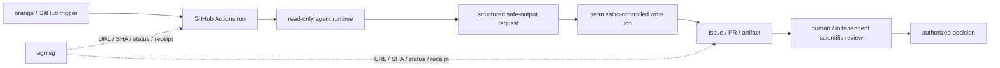

# GitHub-native agent governance 再設計

- 状態: proposed（未実装）
- 作成日: 2026-08-02
- 採否決定者: orange（未決定）
- 追跡: [Issue #152](https://github.com/orangewk/wigner-splat/issues/152)
- 再発明評価: [`../2026-08-02-agent-provenance-reinvention-assessment--done.md`](../2026-08-02-agent-provenance-reinvention-assessment--done.md)
- 旧設計: [`2026-08-01-sebastian-governance-mechanism--dead.md`](2026-08-01-sebastian-governance-mechanism--dead.md)
- 公開境界: [`../2026-07-25-public-private-layer-separation--recorded.md`](../2026-07-25-public-private-layer-separation--recorded.md)

## 1. 決定案

agent execution、GitHub write、platform auditの基盤を独自実装しない。[GitHub Agentic Workflows](https://github.github.com/gh-aw/)とGitHub標準のIssue、PR、review、Actions run、branch protectionを第一候補とする。

project側に残すのは科学研究固有のauthority policyだけである。`agmsg`はuser-globalな配送路に限定する。

## 2. 三層の責務

### GitHub control plane

- workflow triggerと`github.actor`
- Actions run ID、workflow ref、job結果
- agent runtimeのtoken / secret境界
- Safe Outputsの許可operation、件数、対象
- Issue、PR、commit、review、merge event
- branch protection、required review、stale approval
- platformが提供する署名とsession link

これらを手書きprovenanceへ複写しない。URLまたはAPIから導出する。

本書で **derive / 導出可能** とは、人間の記憶やagentの自由記述による自己申告に頼らず、一つの安定したGitHub URL、または文書化した一つのGitHub API queryから同じ値を再取得できることをいう。pilotでは取得元URLまたはqueryも記録する。

### Project scientific policy

- `activity`: authoring / verification / validation / decision
- `verification_kind`: implementation / reproducibility
- `validation_kind`: numerical / mathematical / citation / scientific-scope
- GitHub objectだけでは一意にならないartifact scope
- spec-ownerとartifact authorの関係
- reviewerの科学的独立性
- path identity、input digest、call target等の実験固有検査
- decision owner、HOLD理由、再開条件

### agmsg delivery

- task / run / PR URL
- exact SHAまたはartifact URL
- request / status / question / receipt
- public GitHubへ置けないvendor ref

claim、review本文、decision本文、GitHub actor情報は複写しない。

## 3. keep / derive / drop

| 現行field / 機能 | 再設計 |
|---|---|
| `actor_id` | GitHub actor、Actions run、agent sessionからderive。platform外runnerだけ`source: local-unverified`とする |
| `vendor_ref` | GitHub session / run URLからderive。private local sessionだけagmsg側に保持 |
| `delegated_by` / `delegation_chain` | trigger、assign、workflow callからderive可能性をpilotで確認。導出不能な科学委譲だけcustom record |
| exact commit | PR head / commit objectからderive |
| `artifact_scope` | PR全体ならderive。部分成果や非Git artifactだけcustom field |
| `epistemic_status` | GitHub stateと同一視せず、科学claimに必要な場合だけ残す |
| task状態機械 | Issue / PR / Actions statusと重複する状態をdrop。HOLD / scientific decisionだけ残す |
| write gate | Safe Outputs、Actions permissions、branch protectionへ移す |
| agent reviewの権限制限 | Safe Outputsのallowed review eventsとbranch ruleへ移す |
| manual YAML stamp | 原則drop。GitHubから導出不能な科学metadataだけ短いformで残す |

## 4. identityとapprovalの境界

GitHub identityはplatform eventの実行主体を示すが、科学的authorityを自動付与しない。

同じ`orangewk` credentialをagentとorange本人が共有する経路では、personhoodや本人承認を証明できない。GitHub-native pilotではagent runtimeへorangeの長命tokenを渡さず、read-only tokenと隔離されたwrite jobを使う。

人間approvalを必要とする場合は、PR review、merge、またはprotected environmentのGitHub eventを参照する。ただしsolo operator、Copilot task起動者のapproval count、repository planによる制約をpilotで確認する。確認前に「orange本人の暗号学的承認」と表現しない。

## 5. セバスチャンの責務

セバスチャンまたは同等routerは、task分解、配送、依存関係整理、証拠不足、scope drift、claim衝突の指摘、review要求と結果の参照、GitHub run / PR / SHAのstatus整理、追加調査、HOLD、再計算のadviceを行える。

自分が作成・変更したartifactのreview、reviewer出力の自己再検算、自分が作成したacceptance criteriaの通過判定、GitHub上のwrite成功を科学的acceptanceへ読み替えることは独立gateとして数えない。

GitHub Safe Outputが成功しても、それは許可operationが実行されたというplatform factであり、科学的validationではない。

### 5.1 独立reviewの条件

次をすべて満たす場合だけ、reviewを独立gateとして数える。

1. reviewerがartifact authorと異なる作業主体である。
2. reviewerへの委譲経路にartifact authorが含まれない。
3. reviewerが対象版のspecまたはacceptance criteriaを作成・変更していない。
4. reviewがexact artifact SHAまたはcontent digestとartifact scopeを指定し、判定時点の対象版と一致する。
5. activityが`verification`または`validation`であり、該当するkindを明記する。
6. reviewerがartifact authorからhandoffされた同一作業の継続主体ではない。

GitHub actor、vendor、model、sessionが異なることや、本文の「独立review」表記だけでは不足する。GitHubから委譲経路やhandoff関係を導出できない場合は、導出不能な関係だけを短いcustom recordとして残す。authorは自分のreviewerを選任しない。

### 5.2 authority matrix

| 行為 | orange | メインランナー / router | spec-owner | worker | 独立verifier |
|---|---|---|---|---|---|
| project policy承認 | 可 | 不可 | 不可 | 不可 | 不可 |
| task作成・担当割当 | 可 | 承認済みpolicy内で可 | 原則不可 | 原則不可 | 原則不可 |
| worker / reviewerへの委譲 | 可 | 承認済みpolicy内で可 | 明示された再委譲のみ | 同左 | 原則不可 |
| request / status / question | 可 | 可 | 可 | 可 | 可 |
| advice / evidence | 可 | 可 | 可 | 可 | 可 |
| 自作artifactのverification / validation | 独立gateに不採用 | 同左 | 同左 | 同左 | 同左 |
| 他者artifactのverification / validation | 委任時のみ | §5.1を満たす時のみ | 同左 | 同左 | 委譲範囲で可 |
| routineなacceptance criteria明確化 | 可 | proposalのみ | 委譲範囲で可 | proposalのみ | proposalのみ |
| 高影響なacceptance criteria変更 | 可 | proposalのみ | proposalのみ | proposalのみ | proposalのみ |
| accept / hold / reject | 可 | 明示decision owner時のみ | 同左 | 不可 | 原則recommendationのみ |
| publish / main昇格の決定 | 可 | 不可 | 不可 | 不可 | 不可 |
| orange決定済みpublishの実行 | 可 | 明示委譲時のみ | 不可 | 不可 | 不可 |

routineな明確化とは、承認済みの研究目的と証拠水準を緩めず、判定手順を具体化する変更をいう。研究目的、証拠水準、公開claim、public / private境界を変える変更は高影響としてorangeへ戻す。spec-ownerやdecision ownerの指定は、§5.1の独立review条件を免除しない。

publish authorityはorangeだけが発生させる。routerは、GitHub上で参照可能なorangeの決定を実行できるが、自分でpublish decisionを作らない。同じcredentialを共有する投稿しかない場合は、本人承認を機構的に検証済みとは表現しない。

### 5.3 activity語彙

- `request`: taskまたは追加作業の依頼
- `question`: 不明点・入力要求
- `status`: 進行状況。採否を含まない
- `advice`: 指摘・仮説・方向提案。未批准
- `authoring`: brief、code、report、acceptance criteria等の作成・変更
- `evidence`: 出典、計算、test結果、artifact参照
- `verification`: 実装適合性または再現性の確認。`verification_kind`を伴う
- `validation`: 数学・数値・引用・科学的射程の妥当性確認。`validation_kind`を伴う
- `decision`: `accept / hold / reject`
- `publish-execution`: GitHub上で参照可能なorange decisionの実行
- `withdrawal`: 過去記録またはclaimの撤回
- `handoff`: 作業主体と未解決taskの引き継ぎ
- `receipt`: delivery / read / process ACK

本文中の「通過」「GO」「確認済み」は表示文字であり、activityやauthorityを変更しない。

### 5.4 public / private境界

公開面の規範は[`2026-07-25-public-private-layer-separation--recorded.md`](../2026-07-25-public-private-layer-separation--recorded.md)に従う。第三者の同意、非公開vendor session ID、secret、local path、private promptや会話本文をpublic Issue、PR、artifact、Actions logへ出さない。GitHub Actionsのworkflow log、step summary、artifact、cache、annotationは、repository設定と保持期間をPhase Bで確認するまで公開面へ出得るものとして扱う。科学的失敗や自己批判的な研究記録は、この境界だけを理由に非公開化しない。

## 6. 導入手順

### Phase A — capability mapping

Issue #152で、現行fieldをGitHub-nativeからderiveできるか確認する。文書とAPI仕様だけで断定せず、未確認項目を列挙する。

### Phase B — read-only / docs-only pilot

Public Previewであるため、科学claimや本番publishを伴わない一件だけを使う。engineとActions runの対応、agentに渡るpermissionとsecret、Safe Outputを適用したactor、PR / commit author、signature、triggering user、runまたはsessionへの逆参照、未許可write、APPROVE、protected file変更の拒否、exact PR head変更後のreview扱いを確認する。加えて、`engine: claude`、`engine: codex`等が要求するvendor API keyの種類・保存先・rotation・fork時の非公開性、既存subscriptionとの関係、API従量課金、budget上限、失敗runの費用を実測する。workflow log、step summary、artifact、cache、annotationの閲覧範囲と保持期間を、public repositoryで実行する前にdocs-only fixtureで確認する。

### Phase C — policy縮約

pilot実測後、GitHubから導出できたfieldを現行manual schemaから削除する。科学的独立性を表す最小fieldだけを残す。

### Phase D — 採否

orangeが、gh-awを継続利用するか、Issue #146をclose / supersede / 限定再開するか、project共通policyを他repositoryへ移植するかを決める。

## 7. acceptance criteria

1. actor、run、write、review、mergeのplatform factをGitHub URL / APIから復元できる。
2. agent runtimeがorangeの長命GitHub credentialを保持しない。
3. agentの直接writeを許可せず、Safe Outputsまたは同等の隔離jobを通す。
4. GitHub factと科学的authorityを別fieldとして扱う。
5. routerの自己検算を独立reviewへ数えない。
6. 手書きprovenanceはGitHubから導出不能なfieldだけである。
7. agmsgは正本を複写せず参照だけを配送する。
8. 独自infraを提案する場合、GitHub-nativeで不足した実測事実を最低3件示す。
9. orange承認前に本番task、main publish、科学claimへ適用しない。
10. Actionsの公開面へprivate情報を出さず、vendor keyと費用の運用責任を決定前に記録する。

## 8. 非目標

- GitHub Agentic Workflowsの再実装
- agent identity provider、relay、authority database、独自署名service
- 全messageのstructured event化
- GitHub actorを科学的reviewer能力の証明として扱うこと
- vendor間の推論方法やreview styleの統一

## 9. 既知の不確実性

- GitHub Agentic Workflowsは2026-08-02時点でPublic Previewである。
- 第三者engineのauthor / session provenanceがCopilot cloud agentと同等とは限らない。
- local interactive agentをGitHub control planeへ直接載せない場合、その実行主体はGitHubだけでは証明できない。
- human approvalの強度はcredential分離とrepository ruleに依存する。
- Claude / Codex等の第三者engineはvendor API keyとAPI課金を要求し得る。既存の対話subscriptionをそのまま利用できるとは仮定しない。
- public repositoryのActions log、summary、artifact等の可視性と保持期間は、private vendor情報の境界へ直接影響する。

これらは独自設計で穴埋めせず、Phase Bの実測結果を待つ。
