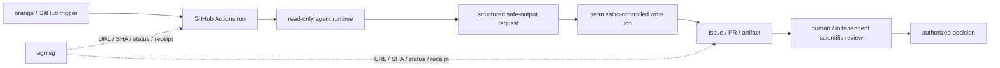

# GitHub-native agent governance 再設計

- 状態: proposed（未実装）
- 作成日: 2026-08-02
- 決定者: orange
- 追跡: [Issue #152](https://github.com/orangewk/wigner-splat/issues/152)
- 再発明評価: [`../2026-08-02-agent-provenance-reinvention-assessment--done.md`](../2026-08-02-agent-provenance-reinvention-assessment--done.md)
- 旧設計: [`2026-08-01-sebastian-governance-mechanism--proposed.md`](2026-08-01-sebastian-governance-mechanism--proposed.md)

## 1. 決定案

agent execution、GitHub write、platform auditの基盤を独自実装しない。[GitHub Agentic Workflows](https://github.github.com/gh-aw/)とGitHub標準のIssue、PR、review、Actions run、branch protectionを第一候補とする。

project側に残すのは科学研究固有のauthority policyだけである。`agmsg`はuser-globalな配送路に限定する。

## 2. 三層の責務

### GitHub control plane

- workflow triggerと`github.actor`
- Actions run ID、workflow ref、job結果
- agent runtimeのtoken / secret境界
- Safe Outputsの許可operation、件数、対象
- Issue、PR、commit、review、merge event
- branch protection、required review、stale approval
- platformが提供する署名とsession link

これらを手書きprovenanceへ複写しない。URLまたはAPIから導出する。

### Project scientific policy

- `activity`: authoring / verification / validation / decision
- `validation_kind`: implementation / numerical / mathematical / citation / scientific-scope
- GitHub objectだけでは一意にならないartifact scope
- spec-ownerとartifact authorの関係
- reviewerの科学的独立性
- path identity、input digest、call target等の実験固有検査
- decision owner、HOLD理由、再開条件

### agmsg delivery

- task / run / PR URL
- exact SHAまたはartifact URL
- request / status / question / receipt
- public GitHubへ置けないvendor ref

claim、review本文、decision本文、GitHub actor情報は複写しない。

## 3. keep / derive / drop

| 現行field / 機能 | 再設計 |
|---|---|
| `actor_id` | GitHub actor、Actions run、agent sessionからderive。platform外runnerだけ`source: local-unverified`とする |
| `vendor_ref` | GitHub session / run URLからderive。private local sessionだけagmsg側に保持 |
| `delegated_by` / `delegation_chain` | trigger、assign、workflow callからderive可能性をpilotで確認。導出不能な科学委譲だけcustom record |
| exact commit | PR head / commit objectからderive |
| `artifact_scope` | PR全体ならderive。部分成果や非Git artifactだけcustom field |
| `epistemic_status` | GitHub stateと同一視せず、科学claimに必要な場合だけ残す |
| task状態機械 | Issue / PR / Actions statusと重複する状態をdrop。HOLD / scientific decisionだけ残す |
| write gate | Safe Outputs、Actions permissions、branch protectionへ移す |
| agent reviewの権限制限 | Safe Outputsのallowed review eventsとbranch ruleへ移す |
| manual YAML stamp | 原則drop。GitHubから導出不能な科学metadataだけ短いformで残す |

## 4. identityとapprovalの境界

GitHub identityはplatform eventの実行主体を示すが、科学的authorityを自動付与しない。

同じ`orangewk` credentialをagentとorange本人が共有する経路では、personhoodや本人承認を証明できない。GitHub-native pilotではagent runtimeへorangeの長命tokenを渡さず、read-only tokenと隔離されたwrite jobを使う。

人間approvalを必要とする場合は、PR review、merge、またはprotected environmentのGitHub eventを参照する。ただしsolo operator、Copilot task起動者のapproval count、repository planによる制約をpilotで確認する。確認前に「orange本人の暗号学的承認」と表現しない。

## 5. セバスチャンの責務

セバスチャンまたは同等routerは、task分解、配送、依存関係整理、証拠不足、scope drift、claim衝突の指摘、review要求と結果の参照、GitHub run / PR / SHAのstatus整理、追加調査、HOLD、再計算のadviceを行える。

自分が作成・変更したartifactのreview、reviewer出力の自己再検算、自分が作成したacceptance criteriaの通過判定、GitHub上のwrite成功を科学的acceptanceへ読み替えることは独立gateとして数えない。

GitHub Safe Outputが成功しても、それは許可operationが実行されたというplatform factであり、科学的validationではない。

## 6. 導入手順

### Phase A — capability mapping

Issue #152で、現行fieldをGitHub-nativeからderiveできるか確認する。文書とAPI仕様だけで断定せず、未確認項目を列挙する。

### Phase B — read-only / docs-only pilot

Public Previewであるため、科学claimや本番publishを伴わない一件だけを使う。engineとActions runの対応、agentに渡るpermissionとsecret、Safe Outputを適用したactor、PR / commit author、signature、triggering user、runまたはsessionへの逆参照、未許可write、APPROVE、protected file変更の拒否、exact PR head変更後のreview扱い、費用と運用負荷を確認する。

### Phase C — policy縮約

pilot実測後、GitHubから導出できたfieldを現行manual schemaから削除する。科学的独立性を表す最小fieldだけを残す。

### Phase D — 採否

orangeが、gh-awを継続利用するか、Issue #146をclose / supersede / 限定再開するか、project共通policyを他repositoryへ移植するかを決める。

## 7. acceptance criteria

1. actor、run、write、review、mergeのplatform factをGitHub URL / APIから復元できる。
2. agent runtimeがorangeの長命GitHub credentialを保持しない。
3. agentの直接writeを許可せず、Safe Outputsまたは同等の隔離jobを通す。
4. GitHub factと科学的authorityを別fieldとして扱う。
5. routerの自己検算を独立reviewへ数えない。
6. 手書きprovenanceはGitHubから導出不能なfieldだけである。
7. agmsgは正本を複写せず参照だけを配送する。
8. 独自infraを提案する場合、GitHub-nativeで不足した実測事実を最低3件示す。
9. orange承認前に本番task、main publish、科学claimへ適用しない。

## 8. 非目標

- GitHub Agentic Workflowsの再実装
- agent identity provider、relay、authority database、独自署名service
- 全messageのstructured event化
- GitHub actorを科学的reviewer能力の証明として扱うこと
- vendor間の推論方法やreview styleの統一

## 9. 既知の不確実性

- GitHub Agentic Workflowsは2026-08-02時点でPublic Previewである。
- 第三者engineのauthor / session provenanceがCopilot cloud agentと同等とは限らない。
- local interactive agentをGitHub control planeへ直接載せない場合、その実行主体はGitHubだけでは証明できない。
- human approvalの強度はcredential分離とrepository ruleに依存する。

これらは独自設計で穴埋めせず、Phase Bの実測結果を待つ。
